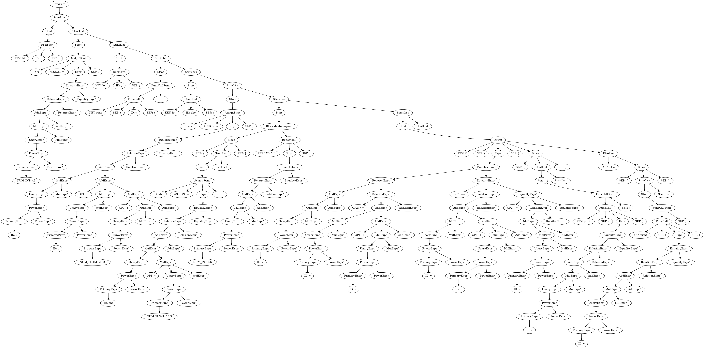

# a. 实验目的
本实验旨在设计并实现一个针对自定义小型编程语言的分析器。通过该实验，深入理解程序设计语言的语法结构与词法分析，从而提高对编译原理核心算法的实践能力。

# b. 实验内容
1. 设计一个简单的编程语言的语法和词法规则。
2. 实现该语言的词法分析器，能够将源代码转换为一系列的记号（tokens）。
3. 实现该语言的语法分析器，能够根据词法分析器生成的记号构建抽象语法树（AST）。
4. 编写测试用例，验证词法分析器和语法分析器的正确性。

# c. 设计思路

## 语言设计

该实验所虚构的语言具有以下基本特性：
- 支持变量声明和赋值（使用let关键字）。
- 支持 if-else 条件语句。
- 支持 read() 和 write() 输入输出操作。
- 支持基本的算术运算（加、减、乘、除）。
- 支持使用语句块^^表达式来表示重复执行的代码段。
- 支持单行注释。

## 词法分析器设计
词法分析器的设计基于正则表达式，用于识别以下记号类型：
- 关键字：let, if, else, read, write
- 标识符：变量名，由字母和数字组成，且以字母开头
- 数字：整数或浮点数
- 运算符：+，-，*，/，=，==，!=，<，>，<=，>=，^^
- 分隔符：;，,，()，{}
- 注释：以 // 开头的单行注释

## 语法分析器设计
语法分析器采用LL(1)分析方法，主要语法规则详见 e 部分。语法分析器将根据词法分析器生成的记号流，构建抽象语法树（AST）。

# d. 假设条件

- 类型检查：假设 ^^ 右侧表达式的结果必须能求值为整数，代表循环次数。
- 声明顺序：假设 let 语句必须出现在变量被赋值或引用之前的物理位置。
- 关键字限制：假设 read 和 print 作为保留字，不能被用作用户定义的变量名。

# e. 相关有限自动机描述

## 正规表达式

- 标识符
`ID   = [A-Za-z_][A-Za-z0-9_]* `
- 数字
`NUM  = [0-9]+(\.[0-9]+)?`
- 注释
`COMMENT = "//" [^\n]* `
- 双字符运算符
`POW2 = "^^" EQ = "==" NEQ = "!=" GE = ">=" LE = "<="`
- 单字符运算符
`POW1 = "^"
ASSIGN = "="
PLUS   = "+"
MINUS  = "-"
MUL    = "*"
DIV    = "/"
GT     = ">"
LT     = "<"
`
- 单字符分隔符
`SEP = [(){};,]`
- 空格
`WS = [ \t\n\r]+`
- 关键字
`KEY = (let|print|read|if|else)`

## NFA
```
ID_NFA:
  states: {s0, s1}
  start: s0
  accept: {s1}
  transitions:
    s0 --[A-Zabcdfghjkmnoqstuvwxyz_]--> s1
    s1 --[A-Za-z0-9_]--> s1

NUM_NFA:
  states: {s0, s1, s2, s3}
  start: s0
  accept: {s1, s3}
  transitions:
    s0 --[0-9]--> s1
    s1 --[0-9]--> s1
    s1 --[.]--> s2
    s2 --[0-9]--> s3
    s3 --[0-9]--> s3

COMMENT_NFA:
  states: {s0, s1, s2}
  start: s0
  accept: {s2}
  transitions:
    s0 --[/]--> s1
    s1 --[/]--> s2
    s2 --[^\n]--> s2

POW2_NFA:
  states: {s0, s1, s2}
  start: s0
  accept: {s2}
  transitions:
    s0 --[\^]--> s1
    s1 --[\^]--> s2

POW1_NFA:
  states: {s0, s1}
  start: s0
  accept: {s1}
  transitions:
    s0 --[\^]--> s1

EQ_NFA:
  states: {s0, s1, s2}
  start: s0
  accept: {s2}
  transitions:
    s0 --[=]--> s1
    s1 --[=]--> s2

NEQ_NFA:
  states: {s0, s1, s2}
  start: s0
  accept: {s2}
  transitions:
    s0 --[!]--> s1
    s1 --[=]--> s2

GE_NFA:
  states: {s0, s1, s2}
  start: s0
  accept: {s2}
  transitions:
    s0 --[>]--> s1
    s1 --[=]--> s2

LE_NFA:
  states: {s0, s1, s2}
  start: s0
  accept: {s2}
  transitions:
    s0 --[<]--> s1
    s1 --[=]--> s2

ASSIGN_NFA:
  states: {s0, s1}
  start: s0
  accept: {s1}
  transitions:
    s0 --[=]--> s1

PLUS_NFA:
  states: {s0, s1}
  start: s0
  accept: {s1}
  transitions:
    s0 --[+]--> s1

MINUS_NFA:
  states: {s0, s1}
  start: s0
  accept: {s1}
  transitions:
    s0 --[-]--> s1

MUL_NFA:
  states: {s0, s1}
  start: s0
  accept: {s1}
  transitions:
    s0 --[*]--> s1

DIV_NFA:
  states: {s0, s1}
  start: s0
  accept: {s1}
  transitions:
    s0 --[/]--> s1

GT_NFA:
  states: {s0, s1}
  start: s0
  accept: {s1}
  transitions:
    s0 --[>]--> s1

LT_NFA:
  states: {s0, s1}
  start: s0
  accept: {s1}
  transitions:
    s0 --[<]--> s1

SEP_NFA:
  states: {s0, s1}
  start: s0
  accept: {s1}
  transitions:
    s0 --[(]--> s1
    s0 --[)]--> s1
    s0 --[{]--> s1
    s0 --[}]--> s1
    s0 --[;]--> s1
    s0 --[,]--> s1

WS_NFA:
  states: {s0, s1}
  start: s0
  accept: {s1}
  transitions:
    s0 --[ \t\n\r]--> s1
    s1 --[ \t\n\r]--> s1

KEY_NFA:
  states: {s0, s1, s2, s3, s4, s5, s6, s7, s8, s9, s10, s11, s12, s13, s14}
  start: s0
  accept: {s3, ID}
  transitions:

    s3 --[A-Za-z0-9_]--> ID
    ID --[A-Za-z0-9_]--> ID
    # "let"
    s0 --[l]--> s1
    s1 --[A-Za-df-z0-9_]--> ID
    s1 --[e]--> s2
    s2 --[A-Za-su-z0-9_]--> ID
    s2 --[t]--> s3

    # "print"
    s0 --[p]--> s4
    s4 --[A-Za-qs-z0-9_]--> ID
    s4 --[r]--> s5
    s5 --[A-Za-hj-z0-9_]--> ID
    s5 --[i]--> s6
    s6 --[A-Za-mo-z0-9_]--> ID
    s6 --[n]--> s7
    s7 --[A-Za-su-z0-9_]--> ID
    s7 --[t]--> s3

    # "read"
    s0 --[r]--> s9
    s9 --[A-Za-qst-z0-9_]--> ID
    s9 --[e]--> s10
    s10 --[A-Zb-z0-9_]--> ID
    s10 --[a]--> s11
    s10 --[A-Za-ce-z0-9_]--> ID
    s11 --[d]--> s3

    # "if"
    s0 --[i]--> s13
    s13 --[A-Za-eg-z0-9_]--> ID
    s13 --[f]--> s3

    # "else"
    s0 --[e]--> s15
    s15 --[A-Za-km-z0-9_]--> ID
    s15 --[l]--> s16
    s16 --[A-Za-rt-z0-9_]--> ID
    s16 --[s]--> s17
    s17 --[A-Za-df-z0-9_]--> ID
    s17 --[e]--> s3
```

## 合并
将上述各个 NFA 合并为一个总的 NFA，通过添加一个新的起始状态，并从该状态出发通过 ε 转移到各个子 NFA 的起始状态。最终接受状态为各子 NFA 的接受状态集合。

```
LEXER_NFA:
  states:
    - S0
    - all states from each sub-NFA (renamed to avoid collision)
  start: S0
  accept:
    - all accept states from each sub-NFA
  transitions:
    # epsilon transitions from global start
    S0 --[ε]--> ID_s0
    S0 --[ε]--> NUM_s0
    S0 --[ε]--> COMMENT_s0
    S0 --[ε]--> POW2_s0
    S0 --[ε]--> POW1_s0
    S0 --[ε]--> EQ_s0
    S0 --[ε]--> NEQ_s0
    S0 --[ε]--> GE_s0
    S0 --[ε]--> LE_s0
    S0 --[ε]--> ASSIGN_s0
    S0 --[ε]--> PLUS_s0
    S0 --[ε]--> MINUS_s0
    S0 --[ε]--> MUL_s0
    S0 --[ε]--> DIV_s0
    S0 --[ε]--> GT_s0
    S0 --[ε]--> LT_s0
    S0 --[ε]--> SEP_s0
    S0 --[ε]--> WS_s0
    S0 --[ε]--> KEY_s0

    ID_s0 --[A-Zabcdfghjkmnoqstuvwxyz_]--> ID_s1
    ID_s1 --[A-ZZa-z0-9_]--> ID_s1

    NUM_s0 --[0-9]--> NUM_s1
    NUM_s1 --[0-9]--> NUM_s1
    NUM_s1 --[.]--> NUM_s2
    NUM_s2 --[0-9]--> NUM_s3
    NUM_s3 --[0-9]--> NUM_s3

    COMMENT_s0 --[/]--> COMMENT_s1
    COMMENT_s1 --[/]--> COMMENT_s2
    COMMENT_s2 --[^\n]--> COMMENT_s2

    POW2_s0 --[\^]--> POW2_s1
    POW2_s1 --[\^]--> POW2_s2

    POW1_s0 --[\^]--> POW1_s1

    EQ_s0 --[=]--> EQ_s1
    EQ_s1 --[=]--> EQ_s2

    NEQ_s0 --[!]--> NEQ_s1
    NEQ_s1 --[=]--> NEQ_s2

    GE_s0 --[>]--> GE_s1
    GE_s1 --[=]--> GE_s2

    LE_s0 --[<]--> LE_s1
    LE_s1 --[=]--> LE_s2

    ASSIGN_s0 --[=]--> ASSIGN_s1

    PLUS_s0 --[+]--> PLUS_s1
    MINUS_s0 --[-]--> MINUS_s1
    MUL_s0 --[*]--> MUL_s1
    DIV_s0 --[/]--> DIV_s1
    GT_s0 --[>]--> GT_s1
    LT_s0 --[<]--> LT_s1

    SEP_s0 --[(]--> SEP_s1
    SEP_s0 --[)]--> SEP_s1
    SEP_s0 --[{]--> SEP_s1
    SEP_s0 --[}]--> SEP_s1
    SEP_s0 --[;]--> SEP_s1
    SEP_s0 --[,]--> SEP_s1

    WS_s0 --[ \t\n\r]--> WS_s1
    WS_s1 --[ \t\n\r]--> WS_s1

    KEY_s3 --[A-Za-z0-9_]--> KEY_ID
    KEY_ID --[A-Za-z0-9_]--> KEY_ID
    # "let"
    KEY_s0 --[l]--> KEY_s1
    KEY_s1 --[A-Za-df-z0-9_]--> KEY_ID
    KEY_s1 --[e]--> KEY_s2
    KEY_s2 --[A-Za-su-z0-9_]--> KEY_ID
    KEY_s2 --[t]--> KEY_s3

    # "print"
    KEY_s0 --[p]--> KEY_s4
    KEY_s4 --[A-Za-qs-z0-9_]--> KEY_ID
    KEY_s4 --[r]--> KEY_s5
    KEY_s5 --[A-Za-hj-z0-9_]--> KEY_ID
    KEY_s5 --[i]--> KEY_s6
    KEY_s6 --[A-Za-mo-z0-9_]--> KEY_ID
    KEY_s6 --[n]--> KEY_s7
    KEY_s7 --[A-Za-su-z0-9_]--> KEY_ID
    KEY_s7 --[t]--> KEY_s3

    # "read"
    KEY_s0 --[r]--> KEY_s9
    KEY_s9 --[A-Za-qst-z0-9_]--> KEY_ID
    KEY_s9 --[e]--> KEY_s10
    KEY_s10 --[A-Zb-z0-9_]--> KEY_ID
    KEY_s10 --[a]--> KEY_s11
    KEY_s10 --[A-Za-ce-z0-9_]--> KEY_ID
    KEY_s11 --[d]--> KEY_s3

    # "if"
    KEY_s0 --[i]--> KEY_s13
    KEY_s13 --[A-Za-eg-z0-9_]--> KEY_ID
    KEY_s13 --[f]--> KEY_s3

    # "else"
    KEY_s0 --[e]--> KEY_s15
    KEY_s15 --[A-Za-km-z0-9_]--> KEY_ID
    KEY_s15 --[l]--> KEY_s16
    KEY_s16 --[A-Za-rt-z0-9_]--> KEY_ID
    KEY_s16 --[s]--> KEY_s17
    KEY_s17 --[A-Za-df-z0-9_]--> KEY_ID
    KEY_s17 --[e]--> KEY_s3
```

## 最小化
通过状态合并和消除不可达状态，对上述 NFA 进行最小化处理，得到一个等价的最小化 DFA，用于实际的词法分析过程。表示为json格式以便于程序读取和处理。

```json
{
    "states": [
        "START",
        "ID",
        "NUM_INT",
        "NUM_MIDDLE",
        "NUM_FLOAT",
        "OP1",
        "OP2",
        "REPEAT",
        "ASSIGN",
        "WS",
        "SEP",
        "COMMENT",
        "KEY"
    ],
    "start": "START",
    "accept": [
        "ID",
        "NUM_INT",
        "NUM_FLOAT",
        "OP1",
        "OP2",
        "REPEAT",
        "ASSIGN",
        "WS",
        "SEP",
        "COMMENT",
        "KEY"
    ],
    "trans": [
        {
            "from": "START",
            "to": "ID",
            "pattern": "[A-Zabcdfghjkmnoqstuvwxyz_]"
        },
        {
            "from": "ID",
            "to": "ID",
            "pattern": "[A-Za-z0-9_]"
        },
        {
            "from": "START",
            "to": "NUM_INT",
            "pattern": "[0-9]"
        },
        {
            "from": "NUM_INT",
            "to": "NUM_INT",
            "pattern": "[0-9]"
        },
        {
            "from": "NUM_INT",
            "to": "NUM_MIDDLE",
            "pattern": "[.]"
        },
        {
            "from": "NUM_MIDDLE",
            "to": "NUM_FLOAT",
            "pattern": "[0-9]"
        },
        {
            "from": "NUM_FLOAT",
            "to": "NUM_FLOAT",
            "pattern": "[0-9]"
        },
        {
            "from": "START",
            "to": "OP1",
            "pattern": "[\\^]"
        },
        {
            "from": "OP1",
            "to": "REPEAT",
            "pattern": "[\\^]"
        },
        {
            "from": "START",
            "to": "ASSIGN",
            "pattern": "[=]"
        },
        {
            "from": "ASSIGN",
            "to": "OP2",
            "pattern": "[=]"
        },
        {
            "from": "START",
            "to": "OP1",
            "pattern": "[<]"
        },
        {
            "from": "OP1",
            "to": "OP2",
            "pattern": "[=]"
        },
        {
            "from": "START",
            "to": "OP1",
            "pattern": "[/]"
        },
        {
            "from": "START",
            "to": "OP1",
            "pattern": "[>]"
        },
        {
            "from": "OP1",
            "to": "OP2",
            "pattern": "[=]"
        },
        {
            "from": "START",
            "to": "OP1",
            "pattern": "[-]"
        },
        {
            "from": "START",
            "to": "OP1",
            "pattern": "[+]"
        },
        {
            "from": "START",
            "to": "OP1",
            "pattern": "[*]"
        },
        {
            "from": "START",
            "to": "WS",
            "pattern": "[ \\t\\n\\r]"
        },
        {
            "from": "WS",
            "to": "WS",
            "pattern": "[ \\t\\n\\r]"
        },
        {
            "from": "START",
            "to": "OP1",
            "pattern": "[!]"
        },
        {
            "from": "OP1",
            "to": "OP2",
            "pattern": "[=]"
        },
        {
            "from": "START",
            "to": "SEP",
            "pattern": "[(){};,]"
        },
        {
            "from": "OP1",
            "to": "COMMENT",
            "pattern": "[/]"
        },
        {
            "from": "COMMENT",
            "to": "COMMENT",
            "pattern": "[^\\n]"
        },
        {
            "from": "KEY",
            "to": "ID",
            "pattern": "[A-Za-z0-9_]"
        },
        {
            "from": "START",
            "to": "LET:L",
            "pattern": "[l]"
        },
        {
            "from": "LET:L",
            "to": "ID",
            "pattern": "[A-Za-df-z0-9_]"
        },
        {
            "from": "LET:L",
            "to": "LET:E",
            "pattern": "[e]"
        },
        {
            "from": "LET:E",
            "to": "ID",
            "pattern": "[A-Za-su-z0-9_]"
        },
        {
            "from": "LET:E",
            "to": "KEY",
            "pattern": "[t]"
        },
        {
            "from": "START",
            "to": "PRINT:P",
            "pattern": "[p]"
        },
        {
            "from": "PRINT:P",
            "to": "ID",
            "pattern": "[A-Za-qs-z0-9_]"
        },
        {
            "from": "PRINT:P",
            "to": "PRINT:R",
            "pattern": "[r]"
        },
        {
            "from": "PRINT:R",
            "to": "ID",
            "pattern": "[A-Za-hj-z0-9_]"
        },
        {
            "from": "PRINT:R",
            "to": "PRINT:I",
            "pattern": "[i]"
        },
        {
            "from": "PRINT:I",
            "to": "ID",
            "pattern": "[A-Za-mo-z0-9_]"
        },
        {
            "from": "PRINT:I",
            "to": "PRINT:N",
            "pattern": "[n]"
        },
        {
            "from": "PRINT:N",
            "to": "ID",
            "pattern": "[A-Za-su-z0-9_]"
        },
        {
            "from": "PRINT:N",
            "to": "KEY",
            "pattern": "[t]"
        },
        {
            "from": "START",
            "to": "READ:R",
            "pattern": "[r]"
        },
        {
            "from": "READ:R",
            "to": "ID",
            "pattern": "[A-Za-df-z0-9_]"
        },
        {
            "from": "READ:R",
            "to": "READ:E",
            "pattern": "[e]"
        },
        {
            "from": "READ:E",
            "to": "ID",
            "pattern": "[A-Zb-z0-9_]"
        },
        {
            "from": "READ:E",
            "to": "READ:A",
            "pattern": "[a]"
        },
        {
            "from": "READ:A",
            "to": "ID",
            "pattern": "[A-Za-ce-z0-9_]"
        },
        {
            "from": "READ:A",
            "to": "KEY",
            "pattern": "[d]"
        },
        {
            "from": "START",
            "to": "IF:I",
            "pattern": "[i]"
        },
        {
            "from": "IF:I",
            "to": "ID",
            "pattern": "[A-Za-eg-z0-9_]"
        },
        {
            "from": "IF:I",
            "to": "KEY",
            "pattern": "[f]"
        },
        {
            "from": "START",
            "to": "ELSE:E",
            "pattern": "[e]"
        },
        {
            "from": "ELSE:E",
            "to": "ID",
            "pattern": "[A-Za-km-z0-9_]"
        },
        {
            "from": "ELSE:E",
            "to": "ELSE:L",
            "pattern": "[l]"
        },
        {
            "from": "ELSE:L",
            "to": "ID",
            "pattern": "[A-Za-rt-z0-9_]"
        },
        {
            "from": "ELSE:L",
            "to": "ELSE:S",
            "pattern": "[s]"
        },
        {
            "from": "ELSE:S",
            "to": "ID",
            "pattern": "[A-Za-df-z0-9_]"
        },
        {
            "from": "ELSE:S",
            "to": "KEY",
            "pattern": "[e]"
        }
    ]
}
```

## CFG

- Program -> StmtList
- StmtList -> Stmt StmtList | ε
- Stmt -> DeclStmt | AssignStmt | BlockMaybeRepeat | FuncCallStmt | IfStmt
- DeclStmt -> KEY(let) ID SEP(;)
- AssignStmt -> ID ASSIGN Expr SEP(;)
- BlockMaybeRepeat -> Block | RepeatTail
- Block -> SEP({) StmtList SEP(})
- FuncCallStmt -> FuncCall SEP(;)
- FuncCall -> KEY(print) SEP(() Expr SEP()) | KEY(read) SEP(() ID SEP())
- IfStmt -> KEY(if) SEP(() Expr SEP()) Block ElsePart
- ElsePart -> KEY(else) Block | ε
- RepeatTail -> REPEAT Expr SEP(;) | ε
- Expr -> EqualityExpr
- EqualityExpr -> RelationExpr EqualityExpr'
- EqualityExpr' -> OP2(==) RelationExpr EqualityExpr' | OP2(!=) RelationExpr EqualityExpr' | ε
- RelationExpr -> AddExpr RelationExpr'
- RelationExpr' -> OP2(>=) AddExpr RelationExpr' | OP2(<=) AddExpr RelationExpr' | OP1(>) AddExpr RelationExpr' | OP1(<) AddExpr RelationExpr' | ε
- AddExpr -> MulExpr AddExpr'
- AddExpr' -> OP1(+) MulExpr AddExpr' | OP1(-) MulExpr AddExpr' | ε
- MulExpr -> UnaryExpr MulExpr'
- MulExpr' -> OP1(*) UnaryExpr MulExpr' | OP1(/) UnaryExpr MulExpr' | ε
- UnaryExpr -> OP1(+) UnaryExpr | OP1(-) UnaryExpr | OP1(!) UnaryExpr | PowerExpr
- PowerExpr -> PrimaryExpr PowerExpr'
- PowerExpr' -> OP1(^) PowerExpr | ε
- PrimaryExpr -> SEP(() Expr SEP()) | NUM_INT | NUM_FLOAT | ID

## First and Follow Sets

- First Sets
  - First(Program) = First(StmtList) = {KEY(let), ID, SEP({), KEY(print), KEY(read), KEY(if), ε}
  - First(Stmt) = {KEY(let), ID, SEP({), KEY(print), KEY(read), KEY(if)}
  - First(DeclStmt) = {KEY(let)}
  - First(AssignStmt) = {ID}
  - First(BlockMaybeRepeat) = First(Block) = {SEP({)}
  - First(FuncCallStmt) = First(FuncCall) = {KEY(print), KEY(read)}
  - First(IfStmt) = {KEY(if)}
  - First(ElsePart) = {KEY(else), ε}
  - First(RepeatTail) = {REPEAT, ε}
  - First(Expr) = First(EqualityExpr) = First(RelationExpr) = First(AddExpr) = First(MulExpr) = {SEP(() , NUM_INT, NUM_FLOAT, ID, OP1(+), OP1(-), OP1(!)}
  - First(UnaryExpr) = {OP1(+), OP1(-), OP1(!), SEP(() , NUM_INT, NUM_FLOAT, ID}
  - First(EqualityExpr') = {OP2(==), OP2(!=), ε}
  - First(RelationExpr') = {OP2(>=), OP2(<=), OP1(>), OP1(<), ε}
  - First(AddExpr') = {OP1(+), OP1(-), ε}
  - First(MulExpr') = {OP1(*), OP1(/), ε}
  - First(PowerExpr) = {SEP(() , NUM_INT, NUM_FLOAT, ID}
  - First(PowerExpr') = {OP1(^), ε}
  - First(PrimaryExpr) = {SEP(() , NUM_INT, NUM_FLOAT, ID}
- Follow Sets
  - Follow(Program) = {#}
  - Follow(StmtList) = {#, SEP(})}
  - Follow(Stmt) = Follow(DeclStmt) = Follow(AssignStmt) = Follow(IfStmt) = Follow(ElsePart) = Follow(Block) = {KEY(let), ID, SEP({), KEY(print), KEY(read), KEY(if), SEP(}), #}
  - Follow(BlockMaybeRepeat) = {KEY(let), ID, SEP({), KEY(print), KEY(read), KEY(if), SEP(}), #, KEY(else), REPEAT}
  - Follow(RepeatTail) = {KEY(let), ID, SEP({), KEY(print), KEY(read), KEY(if), SEP(}), #}
  - Follow(FuncCallStmt) = Follow(FuncCall) = {SEP(;)}
  - Follow(Expr) = Follow(EqualityExpr) = Follow(EqualityExpr') = {SEP()), SEP(;) }
  - Follow(RelationExpr) = Follow(RelationExpr') = {OP2(==), OP2(!=), SEP()), SEP(;) }
  - Follow(AddExpr) = Follow(AddExpr') = {OP2(>=), OP2(<=), OP1(>), OP1(<), OP2(==), OP2(!=), SEP()), SEP(;) }
  - Follow(MulExpr) = Follow(MulExpr') = {OP1(+), OP1(-), OP2(>=), OP2(<=), OP1(>), OP1(<), OP2(==), OP2(!=), SEP()), SEP(;) }
  - Follow(UnaryExpr) = {OP1(*), OP1(/), OP1(+), OP1(-), OP2(>=), OP2(<=), OP1(>), OP1(<), OP2(==), OP2(!=), SEP()), SEP(;) }
  - Follow(PowerExpr) = Follow(PowerExpr') = {OP1(^), OP1(*), OP1(/), OP1(+), OP1(-), OP2(>=), OP2(<=), OP1(>), OP1(<), OP2(==), OP2(!=), SEP()), SEP(;) }
  - Follow(PrimaryExpr) = {OP1(^), OP1(*), OP1(/), OP1(+), OP1(-), OP2(>=), OP2(<=), OP1(>), OP1(<), OP2(==), OP2(!=), SEP()), SEP(;) }

## LL(1) Parsing Table

*注：此文档由markdown编写，转化为pdf后此表可能展示不全，如需所有详细信息，请阅读report.md文件源码*

| Non-Terminal     | KEY(let)           | ID                    | SEP({)                 | KEY(print)                    | KEY(read)                  | KEY(if)                                   | SEP(()                            | NUM_INT                            | NUM_FLOAT                            | OP1(+)                            | OP1(-)                            | OP1(!)                            | SEP(}) | KEY(else)       | REPEAT             | SEP(;) | #        |
| ---------------- | ------------------ | --------------------- | ---------------------- | ----------------------------- | -------------------------- | ----------------------------------------- | --------------------------------- | ---------------------------------- | ------------------------------------ | --------------------------------- | --------------------------------- | --------------------------------- | ------ | --------------- | ------------------ | ------ | -------- |
| Program          | StmtList           | StmtList              | StmtList               | StmtList                      | StmtList                   | StmtList                                  |                                   |                                    |                                      |                                   |                                   |                                   |        |                 |                    |        | StmtList |
| StmtList         | Stmt StmtList      | Stmt StmtList         | Stmt StmtList          | Stmt StmtList                 | Stmt StmtList              | Stmt StmtList                             |                                   |                                    |                                      |                                   |                                   |                                   | ε      |                 |                    | ε      | ε        |
| Stmt             | DeclStmt           | AssignStmt            | BlockMaybeRepeat       | FuncCallStmt                  | FuncCallStmt               | IfStmt                                    |                                   |                                    |                                      |                                   |                                   |                                   |        |                 |                    |        |          |
| DeclStmt         | KEY(let) ID SEP(;) |                       |                        |                               |                            |                                           |                                   |                                    |                                      |                                   |                                   |                                   |        |                 |                    |        |          |
| AssignStmt       |                    | ID ASSIGN Expr SEP(;) |                        |                               |                            |                                           |                                   |                                    |                                      |                                   |                                   |                                   |        |                 |                    |        |          |
| BlockMaybeRepeat |                    |                       | Block RepeatTail       |                               |                            |                                           |                                   |                                    |                                      |                                   |                                   |                                   |        |                 |                    |        |          |
| RepeatTail       |                    |                       |                        |                               |                            |                                           |                                   |                                    |                                      |                                   |                                   |                                   |        |                 | REPEAT Expr SEP(;) | ε      | ε        |
| Block            |                    |                       | SEP({) StmtList SEP(}) |                               |                            |                                           |                                   |                                    |                                      |                                   |                                   |                                   |        |                 |                    |        |          |
| FuncCallStmt     |                    |                       |                        | FuncCall SEP(;)               | FuncCall SEP(;)            |                                           |                                   |                                    |                                      |                                   |                                   |                                   |        |                 |                    |        |          |
| FuncCall         |                    |                       |                        | KEY(print) SEP(() Expr SEP()) | KEY(read) SEP(() ID SEP()) |                                           |                                   |                                    |                                      |                                   |                                   |                                   |        |                 |                    |        |          |
| IfStmt           |                    |                       |                        |                               |                            | KEY(if) SEP(() Expr SEP()) Block ElsePart |                                   |                                    |                                      |                                   |                                   |                                   |        |                 |                    |        |          |
| ElsePart         |                    |                       |                        |                               |                            |                                           |                                   |                                    |                                      |                                   |                                   |                                   | ε      | KEY(else) Block |                    |        |          |
| Expr             |                    |                       |                        |                               |                            |                                           | SEP(() Expr                       | NUM_INT Expr                       | NUM_FLOAT Expr                       | OP1(+) Expr                       | OP1(-) Expr                       | OP1(!) Expr                       |        |                 |                    |        |          |
| EqualityExpr     |                    |                       |                        |                               |                            |                                           | SEP(() RelationExpr EqualityExpr' | NUM_INT RelationExpr EqualityExpr' | NUM_FLOAT RelationExpr EqualityExpr' | OP1(+) RelationExpr EqualityExpr' | OP1(-) RelationExpr EqualityExpr' | OP1(!) RelationExpr EqualityExpr' |        |                 |                    |        |          |
| EqualityExpr'    |                    |                       |                        |                               |                            |                                           |                                   |                                    |                                      |                                   |                                   |                                   | ε      |                 |                    | ε      | ε        |
| RelationExpr     |                    |                       |                        |                               |                            |                                           | SEP(() AddExpr RelationExpr'      | NUM_INT AddExpr RelationExpr'      | NUM_FLOAT AddExpr RelationExpr'      | OP1(+) AddExpr RelationExpr'      | OP1(-) AddExpr RelationExpr'      | OP1(!) AddExpr RelationExpr'      |        |                 |                    |        |          |
| RelationExpr'    |                    |                       |                        |                               |                            |                                           |                                   |                                    |                                      |                                   |                                   |                                   | ε      |                 |                    | ε      | ε        |
| AddExpr          |                    |                       |                        |                               |                            |                                           | SEP(() MulExpr AddExpr'           | NUM_INT MulExpr AddExpr'           | NUM_FLOAT MulExpr AddExpr'           | OP1(+) MulExpr AddExpr'           | OP1(-) MulExpr AddExpr'           | OP1(!) MulExpr AddExpr'           |        |                 |                    |        |          |
| AddExpr'         |                    |                       |                        |                               |                            |                                           |                                   |                                    |                                      | OP1(+) MulExpr AddExpr'           | OP1(-) MulExpr AddExpr'           |                                   | ε      |                 |                    | ε      | ε        |
| MulExpr          |                    |                       |                        |                               |                            |                                           | SEP(() UnaryExpr MulExpr'         | NUM_INT UnaryExpr MulExpr'         | NUM_FLOAT UnaryExpr MulExpr'         | OP1(+) UnaryExpr MulExpr'         | OP1(-) UnaryExpr MulExpr'         | OP1(!) UnaryExpr MulExpr'         |        |                 |                    |        |          |
| MulExpr'         |                    |                       |                        |                               |                            |                                           |                                   |                                    |                                      |                                   |                                   |                                   | ε      |                 |                    | ε      | ε        |
| UnaryExpr        |                    |                       |                        |                               |                            |                                           | SEP(() PowerExpr                  | NUM_INT PowerExpr                  | NUM_FLOAT PowerExpr                  | OP1(+) UnaryExpr                  | OP1(-) UnaryExpr                  | OP1(!) UnaryExpr                  |        |                 |                    |        |          |
| PowerExpr        |                    |                       |                        |                               |                            |                                           | SEP(() PrimaryExpr PowerExpr'     | NUM_INT PrimaryExpr PowerExpr'     | NUM_FLOAT PrimaryExpr PowerExpr'     |                                   |                                   |                                   |        |                 |                    |        |          |
| PowerExpr'       |                    |                       |                        |                               |                            |                                           |                                   |                                    |                                      |                                   |                                   |                                   | ε      |                 |                    | ε      | ε        |
| PrimaryExpr      |                    |                       |                        |                               |                            |                                           | SEP(() Expr SEP())                | NUM_INT                            | NUM_FLOAT                            |                                   |                                   |                                   |        |                 |                    |        |          |


# f. 重要数据结构描述

## Token
```rust
#[derive(Debug, Clone, PartialEq, Eq, Hash, Serialize)]
pub struct Token {
    pub kind: String,
    pub lexeme: String,
}
```
Token 是词法分析阶段的产物，也是语法分析阶段的最小输入单位。

成员：

kind: 类别标识（如 "ID", "NUM", "IF"），在语法分析中作为终结符匹配。

lexeme: 源代码中的原始文本内容（如变量名 x 或数字 3.14）。

关键逻辑：

to_key() 方法：这是一个映射逻辑，用于在 LL(1) 查表时将具体的 lexeme 归类。例如，所有的标识符在查表时都统一视为 "ID"。

## DFA
```rust
#[derive(Debug, Deserialize)]
struct DFA {
    states: Vec<String>,
    start: String,
    accept: Vec<String>,
    trans: Vec<Transition>,
}
```
该结构用于描述如何从字符串流中切割出 Token。

成员：

states: 状态集合。

start: 起始状态。

accept: 接受状态列表。这里的关键设计是：lex_code 函数将到达的接受状态名称直接作为生成的 Token 的 kind。

trans: 转移函数集合，定义了在当前状态下遇到特定字符（pattern）时应跳转到哪个状态。

## Ll1Table
```rust
#[derive(Debug)]
struct Ll1Table {
    terminals: Vec<Token>,
    non_terminals: Vec<Token>,
    table: HashMap<Token, HashMap<Token, Vec<Token>>>,
}
```
这是语法分析器的“大脑”，决定了给定当前的非终结符和输入符号，应该推导出哪条产生式。

结构： HashMap<Token, HashMap<Token, Vec<Token>>>

外层 Key: 当前栈顶的非终结符（Non-terminal）。

内层 Key: 当前输入的终结符（Terminal/Lookahead）。

Value: 对应的产生式右部（由 Token 组成的向量）。

特殊符号： 支持 ε（空产生式）和 #（输入结束标记）。

## ASTNode (抽象语法树节点)
```
#[derive(Debug, Clone)]
pub enum ASTNode {
    Terminal {
        token: Token,
    },
    NonTerminal {
        kind: String,
        children: Vec<Rc<RefCell<ASTNode>>>,
    },
}
```
这是一个递归的枚举类型，代表了源代码的树形结构化表示。

变体：

Terminal: 叶子节点，存储具体的 Token。

NonTerminal: 中间节点，包含一个类别名（kind）和一组子节点（children）。

设计细节：

使用了 Rc<RefCell<ASTNode>>。这是为了在 LL(1) 解析这种自顶向下的过程中，能够方便地在父节点创建后动态地追加子节点，解决 Rust 的所有权和可变性限制。

# g. 核心算法描述

## 词法分析：基于 DFA 的最大匹配逻辑
`lex_code` 函数是程序的第一道工序，它负责将源代码切割成一个个 Token。

状态转移与贪婪匹配：程序从 pos 位置开始，模拟 DFA 的状态跳转。它不仅记录当前是否到达了 accept（接受）状态，还会尽可能向后多读字符（last_accept_pos）。

回溯机制：如果读到某个字符发现无法继续跳转，它会“回退”到最后一个记录的接受状态。

Token 产出：一旦确定了最长匹配，就将该段文本截取，并以 DFA 状态名作为 Token 的 kind。

## 语法分析：基于栈的 LL(1) 驱动算法
`parse_ll1` 函数是程序最复杂的逻辑所在。它实现了一个非递归的预测分析器，核心逻辑是一个 while 循环：

符号匹配（Match）：

如果栈顶是终结符（Terminal），且与当前输入的 Token 种类一致，则匹配成功，同步弹出栈顶和输入流头部的符号。

展开产生式（Expand）：

如果栈顶是非终结符（Non-Terminal），程序会去 Ll1Table 中查表：table[栈顶符号][当前输入符号]。

查到的结果是一条产生式（如 A -> B C）。程序会将栈顶的 A 弹出，然后将右部的符号 C 和 B 逆序压入栈中（这样 B 就在栈顶，能够先被处理）。

空产生式处理：如果查到的是 ε（epsilon），表示该非终结符可以推导为空，此时只需弹出栈顶，不压入新符号。

## AST 的动态构建逻辑
由于使用的是非递归分析，如何在“展开”产生式的同时构建树状结构是一个难点。代码通过以下方式解决：

同步对象：在将符号压入栈时，不仅压入了符号名，还压入了一个 Rc<RefCell<ASTNode>>。

父子绑定：

当一个非终结符被展开时，它会先创建好所有子节点的“空壳”。

这些子节点被存入父节点的 children 向量中。

同时，这些子节点被压入栈。当后续逻辑处理到这些栈元素时，会直接填充这些“空壳”的内容（如填充 Terminal 的 lexeme）。

引用计数管理：通过 Rc<RefCell<...>>，父节点和栈同时拥有指向子节点的指针，确保了在复杂的压栈/弹栈过程中，树形结构能被正确连接。

# h. 运行用例

测试源代码(./test_code.txt)为
```plaintext
let x;
x = 42;
let y;
read(y);
let abc;
abc = x + y + 23.3;
{
    abc = abc * 23.3;
} ^^ 66;
if (x >= y + x == y + x != y) {print(x);} else {print(y);}
```

运行程序后，输出的 Token 序列(./dfa_lexer/token.txt)为：
```plaintext
AcceptState: KEY             Lexeme: 'let'
AcceptState: WS              Lexeme: ' '
AcceptState: ID              Lexeme: 'x'
AcceptState: SEP             Lexeme: ';'
AcceptState: WS              Lexeme: '\n'
AcceptState: ID              Lexeme: 'x'
AcceptState: WS              Lexeme: ' '
AcceptState: ASSIGN          Lexeme: '='
AcceptState: WS              Lexeme: ' '
AcceptState: NUM_INT         Lexeme: '42'
AcceptState: SEP             Lexeme: ';'
AcceptState: WS              Lexeme: '\n'
AcceptState: KEY             Lexeme: 'let'
AcceptState: WS              Lexeme: ' '
AcceptState: ID              Lexeme: 'y'
AcceptState: SEP             Lexeme: ';'
AcceptState: WS              Lexeme: '\n'
AcceptState: KEY             Lexeme: 'read'
AcceptState: SEP             Lexeme: '('
AcceptState: ID              Lexeme: 'y'
AcceptState: SEP             Lexeme: ')'
AcceptState: SEP             Lexeme: ';'
AcceptState: WS              Lexeme: '\n'
AcceptState: KEY             Lexeme: 'let'
AcceptState: WS              Lexeme: ' '
AcceptState: ID              Lexeme: 'abc'
AcceptState: SEP             Lexeme: ';'
AcceptState: WS              Lexeme: '\n'
AcceptState: ID              Lexeme: 'abc'
AcceptState: WS              Lexeme: ' '
AcceptState: ASSIGN          Lexeme: '='
AcceptState: WS              Lexeme: ' '
AcceptState: ID              Lexeme: 'x'
AcceptState: WS              Lexeme: ' '
AcceptState: OP1             Lexeme: '+'
AcceptState: WS              Lexeme: ' '
AcceptState: ID              Lexeme: 'y'
AcceptState: WS              Lexeme: ' '
AcceptState: OP1             Lexeme: '+'
AcceptState: WS              Lexeme: ' '
AcceptState: NUM_FLOAT       Lexeme: '23.3'
AcceptState: SEP             Lexeme: ';'
AcceptState: WS              Lexeme: '\n'
AcceptState: SEP             Lexeme: '{'
AcceptState: WS              Lexeme: '\n    '
AcceptState: ID              Lexeme: 'abc'
AcceptState: WS              Lexeme: ' '
AcceptState: ASSIGN          Lexeme: '='
AcceptState: WS              Lexeme: ' '
AcceptState: ID              Lexeme: 'abc'
AcceptState: WS              Lexeme: ' '
AcceptState: OP1             Lexeme: '*'
AcceptState: WS              Lexeme: ' '
AcceptState: NUM_FLOAT       Lexeme: '23.3'
AcceptState: SEP             Lexeme: ';'
AcceptState: WS              Lexeme: '\n'
AcceptState: SEP             Lexeme: '}'
AcceptState: WS              Lexeme: ' '
AcceptState: REPEAT          Lexeme: '^^'
AcceptState: WS              Lexeme: ' '
AcceptState: NUM_INT         Lexeme: '66'
AcceptState: SEP             Lexeme: ';'
AcceptState: WS              Lexeme: '\n'
AcceptState: KEY             Lexeme: 'if'
AcceptState: WS              Lexeme: ' '
AcceptState: SEP             Lexeme: '('
AcceptState: ID              Lexeme: 'x'
AcceptState: WS              Lexeme: ' '
AcceptState: OP2             Lexeme: '>='
AcceptState: WS              Lexeme: ' '
AcceptState: ID              Lexeme: 'y'
AcceptState: WS              Lexeme: ' '
AcceptState: OP1             Lexeme: '+'
AcceptState: WS              Lexeme: ' '
AcceptState: ID              Lexeme: 'x'
AcceptState: WS              Lexeme: ' '
AcceptState: OP2             Lexeme: '=='
AcceptState: WS              Lexeme: ' '
AcceptState: ID              Lexeme: 'y'
AcceptState: WS              Lexeme: ' '
AcceptState: OP1             Lexeme: '+'
AcceptState: WS              Lexeme: ' '
AcceptState: ID              Lexeme: 'x'
AcceptState: WS              Lexeme: ' '
AcceptState: OP2             Lexeme: '!='
AcceptState: WS              Lexeme: ' '
AcceptState: ID              Lexeme: 'y'
AcceptState: SEP             Lexeme: ')'
AcceptState: WS              Lexeme: ' '
AcceptState: SEP             Lexeme: '{'
AcceptState: KEY             Lexeme: 'print'
AcceptState: SEP             Lexeme: '('
AcceptState: ID              Lexeme: 'x'
AcceptState: SEP             Lexeme: ')'
AcceptState: SEP             Lexeme: ';'
AcceptState: SEP             Lexeme: '}'
AcceptState: WS              Lexeme: ' '
AcceptState: KEY             Lexeme: 'else'
AcceptState: WS              Lexeme: ' '
AcceptState: SEP             Lexeme: '{'
AcceptState: KEY             Lexeme: 'print'
AcceptState: SEP             Lexeme: '('
AcceptState: ID              Lexeme: 'y'
AcceptState: SEP             Lexeme: ')'
AcceptState: SEP             Lexeme: ';'
AcceptState: SEP             Lexeme: '}'
```
最后，生成的抽象语法树（AST）(./dfa_lexer/ast.json)如下所示：
```json
{
  "type": "NonTerminal",
  "kind": "Program",
  "children": [
    {
      "type": "NonTerminal",
      "kind": "StmtList",
      "children": [
        {
          "type": "NonTerminal",
          "kind": "Stmt",
          "children": [
            {
              "type": "NonTerminal",
              "kind": "DeclStmt",
              "children": [
                {
                  "kind": "Terminal",
                  "token": {
                    "kind": "KEY",
                    "lexeme": "let"
                  }
                },
                {
                  "kind": "Terminal",
                  "token": {
                    "kind": "ID",
                    "lexeme": "x"
                  }
                },
                {
                  "kind": "Terminal",
                  "token": {
                    "kind": "SEP",
                    "lexeme": ";"
                  }
                }
              ]
            }
          ]
        },
        {
          "type": "NonTerminal",
          "kind": "StmtList",
          "children": [
            {
              "type": "NonTerminal",
              "kind": "Stmt",
              "children": [
                {
                  "type": "NonTerminal",
                  "kind": "AssignStmt",
                  "children": [
                    {
                      "kind": "Terminal",
                      "token": {
                        "kind": "ID",
                        "lexeme": "x"
                      }
                    },
                    {
                      "kind": "Terminal",
                      "token": {
                        "kind": "ASSIGN",
                        "lexeme": "="
                      }
                    },
                    {
                      "type": "NonTerminal",
                      "kind": "Expr",
                      "children": [
                        {
                          "type": "NonTerminal",
                          "kind": "EqualityExpr",
                          "children": [
                            {
                              "type": "NonTerminal",
                              "kind": "RelationExpr",
                              "children": [
                                {
                                  "type": "NonTerminal",
                                  "kind": "AddExpr",
                                  "children": [
                                    {
                                      "type": "NonTerminal",
                                      "kind": "MulExpr",
                                      "children": [
                                        {
                                          "type": "NonTerminal",
                                          "kind": "UnaryExpr",
                                          "children": [
                                            {
                                              "type": "NonTerminal",
                                              "kind": "PowerExpr",
                                              "children": [
                                                {
                                                  "type": "NonTerminal",
                                                  "kind": "PrimaryExpr",
                                                  "children": [
                                                    {
                                                      "kind": "Terminal",
                                                      "token": {
                                                        "kind": "NUM_INT",
                                                        "lexeme": "42"
                                                      }
                                                    }
                                                  ]
                                                },
                                                {
                                                  "type": "NonTerminal",
                                                  "kind": "PowerExpr'",
                                                  "children": []
                                                }
                                              ]
                                            }
                                          ]
                                        },
                                        {
                                          "type": "NonTerminal",
                                          "kind": "MulExpr'",
                                          "children": []
                                        }
                                      ]
                                    },
                                    {
                                      "type": "NonTerminal",
                                      "kind": "AddExpr'",
                                      "children": []
                                    }
                                  ]
                                },
                                {
                                  "type": "NonTerminal",
                                  "kind": "RelationExpr'",
                                  "children": []
                                }
                              ]
                            },
                            {
                              "type": "NonTerminal",
                              "kind": "EqualityExpr'",
                              "children": []
                            }
                          ]
                        }
                      ]
                    },
                    {
                      "kind": "Terminal",
                      "token": {
                        "kind": "SEP",
                        "lexeme": ";"
                      }
                    }
                  ]
                }
              ]
            },
            {
              "type": "NonTerminal",
              "kind": "StmtList",
              "children": [
                {
                  "type": "NonTerminal",
                  "kind": "Stmt",
                  "children": [
                    {
                      "type": "NonTerminal",
                      "kind": "DeclStmt",
                      "children": [
                        {
                          "kind": "Terminal",
                          "token": {
                            "kind": "KEY",
                            "lexeme": "let"
                          }
                        },
                        {
                          "kind": "Terminal",
                          "token": {
                            "kind": "ID",
                            "lexeme": "y"
                          }
                        },
                        {
                          "kind": "Terminal",
                          "token": {
                            "kind": "SEP",
                            "lexeme": ";"
                          }
                        }
                      ]
                    }
                  ]
                },
                {
                  "type": "NonTerminal",
                  "kind": "StmtList",
                  "children": [
                    {
                      "type": "NonTerminal",
                      "kind": "Stmt",
                      "children": [
                        {
                          "type": "NonTerminal",
                          "kind": "FuncCallStmt",
                          "children": [
                            {
                              "type": "NonTerminal",
                              "kind": "FuncCall",
                              "children": [
                                {
                                  "kind": "Terminal",
                                  "token": {
                                    "kind": "KEY",
                                    "lexeme": "read"
                                  }
                                },
                                {
                                  "kind": "Terminal",
                                  "token": {
                                    "kind": "SEP",
                                    "lexeme": "("
                                  }
                                },
                                {
                                  "kind": "Terminal",
                                  "token": {
                                    "kind": "ID",
                                    "lexeme": "y"
                                  }
                                },
                                {
                                  "kind": "Terminal",
                                  "token": {
                                    "kind": "SEP",
                                    "lexeme": ")"
                                  }
                                }
                              ]
                            },
                            {
                              "kind": "Terminal",
                              "token": {
                                "kind": "SEP",
                                "lexeme": ";"
                              }
                            }
                          ]
                        }
                      ]
                    },
                    {
                      "type": "NonTerminal",
                      "kind": "StmtList",
                      "children": [
                        {
                          "type": "NonTerminal",
                          "kind": "Stmt",
                          "children": [
                            {
                              "type": "NonTerminal",
                              "kind": "DeclStmt",
                              "children": [
                                {
                                  "kind": "Terminal",
                                  "token": {
                                    "kind": "KEY",
                                    "lexeme": "let"
                                  }
                                },
                                {
                                  "kind": "Terminal",
                                  "token": {
                                    "kind": "ID",
                                    "lexeme": "abc"
                                  }
                                },
                                {
                                  "kind": "Terminal",
                                  "token": {
                                    "kind": "SEP",
                                    "lexeme": ";"
                                  }
                                }
                              ]
                            }
                          ]
                        },
                        {
                          "type": "NonTerminal",
                          "kind": "StmtList",
                          "children": [
                            {
                              "type": "NonTerminal",
                              "kind": "Stmt",
                              "children": [
                                {
                                  "type": "NonTerminal",
                                  "kind": "AssignStmt",
                                  "children": [
                                    {
                                      "kind": "Terminal",
                                      "token": {
                                        "kind": "ID",
                                        "lexeme": "abc"
                                      }
                                    },
                                    {
                                      "kind": "Terminal",
                                      "token": {
                                        "kind": "ASSIGN",
                                        "lexeme": "="
                                      }
                                    },
                                    {
                                      "type": "NonTerminal",
                                      "kind": "Expr",
                                      "children": [
                                        {
                                          "type": "NonTerminal",
                                          "kind": "EqualityExpr",
                                          "children": [
                                            {
                                              "type": "NonTerminal",
                                              "kind": "RelationExpr",
                                              "children": [
                                                {
                                                  "type": "NonTerminal",
                                                  "kind": "AddExpr",
                                                  "children": [
                                                    {
                                                      "type": "NonTerminal",
                                                      "kind": "MulExpr",
                                                      "children": [
                                                        {
                                                          "type": "NonTerminal",
                                                          "kind": "UnaryExpr",
                                                          "children": [
                                                            {
                                                              "type": "NonTerminal",
                                                              "kind": "PowerExpr",
                                                              "children": [
                                                                {
                                                                  "type": "NonTerminal",
                                                                  "kind": "PrimaryExpr",
                                                                  "children": [
                                                                    {
                                                                      "kind": "Terminal",
                                                                      "token": {
                                                                        "kind": "ID",
                                                                        "lexeme": "x"
                                                                      }
                                                                    }
                                                                  ]
                                                                },
                                                                {
                                                                  "type": "NonTerminal",
                                                                  "kind": "PowerExpr'",
                                                                  "children": []
                                                                }
                                                              ]
                                                            }
                                                          ]
                                                        },
                                                        {
                                                          "type": "NonTerminal",
                                                          "kind": "MulExpr'",
                                                          "children": []
                                                        }
                                                      ]
                                                    },
                                                    {
                                                      "type": "NonTerminal",
                                                      "kind": "AddExpr'",
                                                      "children": [
                                                        {
                                                          "kind": "Terminal",
                                                          "token": {
                                                            "kind": "OP1",
                                                            "lexeme": "+"
                                                          }
                                                        },
                                                        {
                                                          "type": "NonTerminal",
                                                          "kind": "MulExpr",
                                                          "children": [
                                                            {
                                                              "type": "NonTerminal",
                                                              "kind": "UnaryExpr",
                                                              "children": [
                                                                {
                                                                  "type": "NonTerminal",
                                                                  "kind": "PowerExpr",
                                                                  "children": [
                                                                    {
                                                                      "type": "NonTerminal",
                                                                      "kind": "PrimaryExpr",
                                                                      "children": [
                                                                        {
                                                                          "kind": "Terminal",
                                                                          "token": {
                                                                            "kind": "ID",
                                                                            "lexeme": "y"
                                                                          }
                                                                        }
                                                                      ]
                                                                    },
                                                                    {
                                                                      "type": "NonTerminal",
                                                                      "kind": "PowerExpr'",
                                                                      "children": []
                                                                    }
                                                                  ]
                                                                }
                                                              ]
                                                            },
                                                            {
                                                              "type": "NonTerminal",
                                                              "kind": "MulExpr'",
                                                              "children": []
                                                            }
                                                          ]
                                                        },
                                                        {
                                                          "type": "NonTerminal",
                                                          "kind": "AddExpr'",
                                                          "children": [
                                                            {
                                                              "kind": "Terminal",
                                                              "token": {
                                                                "kind": "OP1",
                                                                "lexeme": "+"
                                                              }
                                                            },
                                                            {
                                                              "type": "NonTerminal",
                                                              "kind": "MulExpr",
                                                              "children": [
                                                                {
                                                                  "type": "NonTerminal",
                                                                  "kind": "UnaryExpr",
                                                                  "children": [
                                                                    {
                                                                      "type": "NonTerminal",
                                                                      "kind": "PowerExpr",
                                                                      "children": [
                                                                        {
                                                                          "type": "NonTerminal",
                                                                          "kind": "PrimaryExpr",
                                                                          "children": [
                                                                            {
                                                                              "kind": "Terminal",
                                                                              "token": {
                                                                                "kind": "NUM_FLOAT",
                                                                                "lexeme": "23.3"
                                                                              }
                                                                            }
                                                                          ]
                                                                        },
                                                                        {
                                                                          "type": "NonTerminal",
                                                                          "kind": "PowerExpr'",
                                                                          "children": []
                                                                        }
                                                                      ]
                                                                    }
                                                                  ]
                                                                },
                                                                {
                                                                  "type": "NonTerminal",
                                                                  "kind": "MulExpr'",
                                                                  "children": []
                                                                }
                                                              ]
                                                            },
                                                            {
                                                              "type": "NonTerminal",
                                                              "kind": "AddExpr'",
                                                              "children": []
                                                            }
                                                          ]
                                                        }
                                                      ]
                                                    }
                                                  ]
                                                },
                                                {
                                                  "type": "NonTerminal",
                                                  "kind": "RelationExpr'",
                                                  "children": []
                                                }
                                              ]
                                            },
                                            {
                                              "type": "NonTerminal",
                                              "kind": "EqualityExpr'",
                                              "children": []
                                            }
                                          ]
                                        }
                                      ]
                                    },
                                    {
                                      "kind": "Terminal",
                                      "token": {
                                        "kind": "SEP",
                                        "lexeme": ";"
                                      }
                                    }
                                  ]
                                }
                              ]
                            },
                            {
                              "type": "NonTerminal",
                              "kind": "StmtList",
                              "children": [
                                {
                                  "type": "NonTerminal",
                                  "kind": "Stmt",
                                  "children": [
                                    {
                                      "type": "NonTerminal",
                                      "kind": "BlockMaybeRepeat",
                                      "children": [
                                        {
                                          "type": "NonTerminal",
                                          "kind": "Block",
                                          "children": [
                                            {
                                              "kind": "Terminal",
                                              "token": {
                                                "kind": "SEP",
                                                "lexeme": "{"
                                              }
                                            },
                                            {
                                              "type": "NonTerminal",
                                              "kind": "StmtList",
                                              "children": [
                                                {
                                                  "type": "NonTerminal",
                                                  "kind": "Stmt",
                                                  "children": [
                                                    {
                                                      "type": "NonTerminal",
                                                      "kind": "AssignStmt",
                                                      "children": [
                                                        {
                                                          "kind": "Terminal",
                                                          "token": {
                                                            "kind": "ID",
                                                            "lexeme": "abc"
                                                          }
                                                        },
                                                        {
                                                          "kind": "Terminal",
                                                          "token": {
                                                            "kind": "ASSIGN",
                                                            "lexeme": "="
                                                          }
                                                        },
                                                        {
                                                          "type": "NonTerminal",
                                                          "kind": "Expr",
                                                          "children": [
                                                            {
                                                              "type": "NonTerminal",
                                                              "kind": "EqualityExpr",
                                                              "children": [
                                                                {
                                                                  "type": "NonTerminal",
                                                                  "kind": "RelationExpr",
                                                                  "children": [
                                                                    {
                                                                      "type": "NonTerminal",
                                                                      "kind": "AddExpr",
                                                                      "children": [
                                                                        {
                                                                          "type": "NonTerminal",
                                                                          "kind": "MulExpr",
                                                                          "children": [
                                                                            {
                                                                              "type": "NonTerminal",
                                                                              "kind": "UnaryExpr",
                                                                              "children": [
                                                                                {
                                                                                  "type": "NonTerminal",
                                                                                  "kind": "PowerExpr",
                                                                                  "children": [
                                                                                    {
                                                                                      "type": "NonTerminal",
                                                                                      "kind": "PrimaryExpr",
                                                                                      "children": [
                                                                                        {
                                                                                          "kind": "Terminal",
                                                                                          "token": {
                                                                                            "kind": "ID",
                                                                                            "lexeme": "abc"
                                                                                          }
                                                                                        }
                                                                                      ]
                                                                                    },
                                                                                    {
                                                                                      "type": "NonTerminal",
                                                                                      "kind": "PowerExpr'",
                                                                                      "children": []
                                                                                    }
                                                                                  ]
                                                                                }
                                                                              ]
                                                                            },
                                                                            {
                                                                              "type": "NonTerminal",
                                                                              "kind": "MulExpr'",
                                                                              "children": [
                                                                                {
                                                                                  "kind": "Terminal",
                                                                                  "token": {
                                                                                    "kind": "OP1",
                                                                                    "lexeme": "*"
                                                                                  }
                                                                                },
                                                                                {
                                                                                  "type": "NonTerminal",
                                                                                  "kind": "UnaryExpr",
                                                                                  "children": [
                                                                                    {
                                                                                      "type": "NonTerminal",
                                                                                      "kind": "PowerExpr",
                                                                                      "children": [
                                                                                        {
                                                                                          "type": "NonTerminal",
                                                                                          "kind": "PrimaryExpr",
                                                                                          "children": [
                                                                                            {
                                                                                              "kind": "Terminal",
                                                                                              "token": {
                                                                                                "kind": "NUM_FLOAT",
                                                                                                "lexeme": "23.3"
                                                                                              }
                                                                                            }
                                                                                          ]
                                                                                        },
                                                                                        {
                                                                                          "type": "NonTerminal",
                                                                                          "kind": "PowerExpr'",
                                                                                          "children": []
                                                                                        }
                                                                                      ]
                                                                                    }
                                                                                  ]
                                                                                },
                                                                                {
                                                                                  "type": "NonTerminal",
                                                                                  "kind": "MulExpr'",
                                                                                  "children": []
                                                                                }
                                                                              ]
                                                                            }
                                                                          ]
                                                                        },
                                                                        {
                                                                          "type": "NonTerminal",
                                                                          "kind": "AddExpr'",
                                                                          "children": []
                                                                        }
                                                                      ]
                                                                    },
                                                                    {
                                                                      "type": "NonTerminal",
                                                                      "kind": "RelationExpr'",
                                                                      "children": []
                                                                    }
                                                                  ]
                                                                },
                                                                {
                                                                  "type": "NonTerminal",
                                                                  "kind": "EqualityExpr'",
                                                                  "children": []
                                                                }
                                                              ]
                                                            }
                                                          ]
                                                        },
                                                        {
                                                          "kind": "Terminal",
                                                          "token": {
                                                            "kind": "SEP",
                                                            "lexeme": ";"
                                                          }
                                                        }
                                                      ]
                                                    }
                                                  ]
                                                },
                                                {
                                                  "type": "NonTerminal",
                                                  "kind": "StmtList",
                                                  "children": []
                                                }
                                              ]
                                            },
                                            {
                                              "kind": "Terminal",
                                              "token": {
                                                "kind": "SEP",
                                                "lexeme": "}"
                                              }
                                            }
                                          ]
                                        },
                                        {
                                          "type": "NonTerminal",
                                          "kind": "RepeatTail",
                                          "children": [
                                            {
                                              "kind": "Terminal",
                                              "token": {
                                                "kind": "REPEAT",
                                                "lexeme": "^^"
                                              }
                                            },
                                            {
                                              "type": "NonTerminal",
                                              "kind": "Expr",
                                              "children": [
                                                {
                                                  "type": "NonTerminal",
                                                  "kind": "EqualityExpr",
                                                  "children": [
                                                    {
                                                      "type": "NonTerminal",
                                                      "kind": "RelationExpr",
                                                      "children": [
                                                        {
                                                          "type": "NonTerminal",
                                                          "kind": "AddExpr",
                                                          "children": [
                                                            {
                                                              "type": "NonTerminal",
                                                              "kind": "MulExpr",
                                                              "children": [
                                                                {
                                                                  "type": "NonTerminal",
                                                                  "kind": "UnaryExpr",
                                                                  "children": [
                                                                    {
                                                                      "type": "NonTerminal",
                                                                      "kind": "PowerExpr",
                                                                      "children": [
                                                                        {
                                                                          "type": "NonTerminal",
                                                                          "kind": "PrimaryExpr",
                                                                          "children": [
                                                                            {
                                                                              "kind": "Terminal",
                                                                              "token": {
                                                                                "kind": "NUM_INT",
                                                                                "lexeme": "66"
                                                                              }
                                                                            }
                                                                          ]
                                                                        },
                                                                        {
                                                                          "type": "NonTerminal",
                                                                          "kind": "PowerExpr'",
                                                                          "children": []
                                                                        }
                                                                      ]
                                                                    }
                                                                  ]
                                                                },
                                                                {
                                                                  "type": "NonTerminal",
                                                                  "kind": "MulExpr'",
                                                                  "children": []
                                                                }
                                                              ]
                                                            },
                                                            {
                                                              "type": "NonTerminal",
                                                              "kind": "AddExpr'",
                                                              "children": []
                                                            }
                                                          ]
                                                        },
                                                        {
                                                          "type": "NonTerminal",
                                                          "kind": "RelationExpr'",
                                                          "children": []
                                                        }
                                                      ]
                                                    },
                                                    {
                                                      "type": "NonTerminal",
                                                      "kind": "EqualityExpr'",
                                                      "children": []
                                                    }
                                                  ]
                                                }
                                              ]
                                            },
                                            {
                                              "kind": "Terminal",
                                              "token": {
                                                "kind": "SEP",
                                                "lexeme": ";"
                                              }
                                            }
                                          ]
                                        }
                                      ]
                                    }
                                  ]
                                },
                                {
                                  "type": "NonTerminal",
                                  "kind": "StmtList",
                                  "children": [
                                    {
                                      "type": "NonTerminal",
                                      "kind": "Stmt",
                                      "children": [
                                        {
                                          "type": "NonTerminal",
                                          "kind": "IfStmt",
                                          "children": [
                                            {
                                              "kind": "Terminal",
                                              "token": {
                                                "kind": "KEY",
                                                "lexeme": "if"
                                              }
                                            },
                                            {
                                              "kind": "Terminal",
                                              "token": {
                                                "kind": "SEP",
                                                "lexeme": "("
                                              }
                                            },
                                            {
                                              "type": "NonTerminal",
                                              "kind": "Expr",
                                              "children": [
                                                {
                                                  "type": "NonTerminal",
                                                  "kind": "EqualityExpr",
                                                  "children": [
                                                    {
                                                      "type": "NonTerminal",
                                                      "kind": "RelationExpr",
                                                      "children": [
                                                        {
                                                          "type": "NonTerminal",
                                                          "kind": "AddExpr",
                                                          "children": [
                                                            {
                                                              "type": "NonTerminal",
                                                              "kind": "MulExpr",
                                                              "children": [
                                                                {
                                                                  "type": "NonTerminal",
                                                                  "kind": "UnaryExpr",
                                                                  "children": [
                                                                    {
                                                                      "type": "NonTerminal",
                                                                      "kind": "PowerExpr",
                                                                      "children": [
                                                                        {
                                                                          "type": "NonTerminal",
                                                                          "kind": "PrimaryExpr",
                                                                          "children": [
                                                                            {
                                                                              "kind": "Terminal",
                                                                              "token": {
                                                                                "kind": "ID",
                                                                                "lexeme": "x"
                                                                              }
                                                                            }
                                                                          ]
                                                                        },
                                                                        {
                                                                          "type": "NonTerminal",
                                                                          "kind": "PowerExpr'",
                                                                          "children": []
                                                                        }
                                                                      ]
                                                                    }
                                                                  ]
                                                                },
                                                                {
                                                                  "type": "NonTerminal",
                                                                  "kind": "MulExpr'",
                                                                  "children": []
                                                                }
                                                              ]
                                                            },
                                                            {
                                                              "type": "NonTerminal",
                                                              "kind": "AddExpr'",
                                                              "children": []
                                                            }
                                                          ]
                                                        },
                                                        {
                                                          "type": "NonTerminal",
                                                          "kind": "RelationExpr'",
                                                          "children": [
                                                            {
                                                              "kind": "Terminal",
                                                              "token": {
                                                                "kind": "OP2",
                                                                "lexeme": ">="
                                                              }
                                                            },
                                                            {
                                                              "type": "NonTerminal",
                                                              "kind": "AddExpr",
                                                              "children": [
                                                                {
                                                                  "type": "NonTerminal",
                                                                  "kind": "MulExpr",
                                                                  "children": [
                                                                    {
                                                                      "type": "NonTerminal",
                                                                      "kind": "UnaryExpr",
                                                                      "children": [
                                                                        {
                                                                          "type": "NonTerminal",
                                                                          "kind": "PowerExpr",
                                                                          "children": [
                                                                            {
                                                                              "type": "NonTerminal",
                                                                              "kind": "PrimaryExpr",
                                                                              "children": [
                                                                                {
                                                                                  "kind": "Terminal",
                                                                                  "token": {
                                                                                    "kind": "ID",
                                                                                    "lexeme": "y"
                                                                                  }
                                                                                }
                                                                              ]
                                                                            },
                                                                            {
                                                                              "type": "NonTerminal",
                                                                              "kind": "PowerExpr'",
                                                                              "children": []
                                                                            }
                                                                          ]
                                                                        }
                                                                      ]
                                                                    },
                                                                    {
                                                                      "type": "NonTerminal",
                                                                      "kind": "MulExpr'",
                                                                      "children": []
                                                                    }
                                                                  ]
                                                                },
                                                                {
                                                                  "type": "NonTerminal",
                                                                  "kind": "AddExpr'",
                                                                  "children": [
                                                                    {
                                                                      "kind": "Terminal",
                                                                      "token": {
                                                                        "kind": "OP1",
                                                                        "lexeme": "+"
                                                                      }
                                                                    },
                                                                    {
                                                                      "type": "NonTerminal",
                                                                      "kind": "MulExpr",
                                                                      "children": [
                                                                        {
                                                                          "type": "NonTerminal",
                                                                          "kind": "UnaryExpr",
                                                                          "children": [
                                                                            {
                                                                              "type": "NonTerminal",
                                                                              "kind": "PowerExpr",
                                                                              "children": [
                                                                                {
                                                                                  "type": "NonTerminal",
                                                                                  "kind": "PrimaryExpr",
                                                                                  "children": [
                                                                                    {
                                                                                      "kind": "Terminal",
                                                                                      "token": {
                                                                                        "kind": "ID",
                                                                                        "lexeme": "x"
                                                                                      }
                                                                                    }
                                                                                  ]
                                                                                },
                                                                                {
                                                                                  "type": "NonTerminal",
                                                                                  "kind": "PowerExpr'",
                                                                                  "children": []
                                                                                }
                                                                              ]
                                                                            }
                                                                          ]
                                                                        },
                                                                        {
                                                                          "type": "NonTerminal",
                                                                          "kind": "MulExpr'",
                                                                          "children": []
                                                                        }
                                                                      ]
                                                                    },
                                                                    {
                                                                      "type": "NonTerminal",
                                                                      "kind": "AddExpr'",
                                                                      "children": []
                                                                    }
                                                                  ]
                                                                }
                                                              ]
                                                            },
                                                            {
                                                              "type": "NonTerminal",
                                                              "kind": "RelationExpr'",
                                                              "children": []
                                                            }
                                                          ]
                                                        }
                                                      ]
                                                    },
                                                    {
                                                      "type": "NonTerminal",
                                                      "kind": "EqualityExpr'",
                                                      "children": [
                                                        {
                                                          "kind": "Terminal",
                                                          "token": {
                                                            "kind": "OP2",
                                                            "lexeme": "=="
                                                          }
                                                        },
                                                        {
                                                          "type": "NonTerminal",
                                                          "kind": "RelationExpr",
                                                          "children": [
                                                            {
                                                              "type": "NonTerminal",
                                                              "kind": "AddExpr",
                                                              "children": [
                                                                {
                                                                  "type": "NonTerminal",
                                                                  "kind": "MulExpr",
                                                                  "children": [
                                                                    {
                                                                      "type": "NonTerminal",
                                                                      "kind": "UnaryExpr",
                                                                      "children": [
                                                                        {
                                                                          "type": "NonTerminal",
                                                                          "kind": "PowerExpr",
                                                                          "children": [
                                                                            {
                                                                              "type": "NonTerminal",
                                                                              "kind": "PrimaryExpr",
                                                                              "children": [
                                                                                {
                                                                                  "kind": "Terminal",
                                                                                  "token": {
                                                                                    "kind": "ID",
                                                                                    "lexeme": "y"
                                                                                  }
                                                                                }
                                                                              ]
                                                                            },
                                                                            {
                                                                              "type": "NonTerminal",
                                                                              "kind": "PowerExpr'",
                                                                              "children": []
                                                                            }
                                                                          ]
                                                                        }
                                                                      ]
                                                                    },
                                                                    {
                                                                      "type": "NonTerminal",
                                                                      "kind": "MulExpr'",
                                                                      "children": []
                                                                    }
                                                                  ]
                                                                },
                                                                {
                                                                  "type": "NonTerminal",
                                                                  "kind": "AddExpr'",
                                                                  "children": [
                                                                    {
                                                                      "kind": "Terminal",
                                                                      "token": {
                                                                        "kind": "OP1",
                                                                        "lexeme": "+"
                                                                      }
                                                                    },
                                                                    {
                                                                      "type": "NonTerminal",
                                                                      "kind": "MulExpr",
                                                                      "children": [
                                                                        {
                                                                          "type": "NonTerminal",
                                                                          "kind": "UnaryExpr",
                                                                          "children": [
                                                                            {
                                                                              "type": "NonTerminal",
                                                                              "kind": "PowerExpr",
                                                                              "children": [
                                                                                {
                                                                                  "type": "NonTerminal",
                                                                                  "kind": "PrimaryExpr",
                                                                                  "children": [
                                                                                    {
                                                                                      "kind": "Terminal",
                                                                                      "token": {
                                                                                        "kind": "ID",
                                                                                        "lexeme": "x"
                                                                                      }
                                                                                    }
                                                                                  ]
                                                                                },
                                                                                {
                                                                                  "type": "NonTerminal",
                                                                                  "kind": "PowerExpr'",
                                                                                  "children": []
                                                                                }
                                                                              ]
                                                                            }
                                                                          ]
                                                                        },
                                                                        {
                                                                          "type": "NonTerminal",
                                                                          "kind": "MulExpr'",
                                                                          "children": []
                                                                        }
                                                                      ]
                                                                    },
                                                                    {
                                                                      "type": "NonTerminal",
                                                                      "kind": "AddExpr'",
                                                                      "children": []
                                                                    }
                                                                  ]
                                                                }
                                                              ]
                                                            },
                                                            {
                                                              "type": "NonTerminal",
                                                              "kind": "RelationExpr'",
                                                              "children": []
                                                            }
                                                          ]
                                                        },
                                                        {
                                                          "type": "NonTerminal",
                                                          "kind": "EqualityExpr'",
                                                          "children": [
                                                            {
                                                              "kind": "Terminal",
                                                              "token": {
                                                                "kind": "OP2",
                                                                "lexeme": "!="
                                                              }
                                                            },
                                                            {
                                                              "type": "NonTerminal",
                                                              "kind": "RelationExpr",
                                                              "children": [
                                                                {
                                                                  "type": "NonTerminal",
                                                                  "kind": "AddExpr",
                                                                  "children": [
                                                                    {
                                                                      "type": "NonTerminal",
                                                                      "kind": "MulExpr",
                                                                      "children": [
                                                                        {
                                                                          "type": "NonTerminal",
                                                                          "kind": "UnaryExpr",
                                                                          "children": [
                                                                            {
                                                                              "type": "NonTerminal",
                                                                              "kind": "PowerExpr",
                                                                              "children": [
                                                                                {
                                                                                  "type": "NonTerminal",
                                                                                  "kind": "PrimaryExpr",
                                                                                  "children": [
                                                                                    {
                                                                                      "kind": "Terminal",
                                                                                      "token": {
                                                                                        "kind": "ID",
                                                                                        "lexeme": "y"
                                                                                      }
                                                                                    }
                                                                                  ]
                                                                                },
                                                                                {
                                                                                  "type": "NonTerminal",
                                                                                  "kind": "PowerExpr'",
                                                                                  "children": []
                                                                                }
                                                                              ]
                                                                            }
                                                                          ]
                                                                        },
                                                                        {
                                                                          "type": "NonTerminal",
                                                                          "kind": "MulExpr'",
                                                                          "children": []
                                                                        }
                                                                      ]
                                                                    },
                                                                    {
                                                                      "type": "NonTerminal",
                                                                      "kind": "AddExpr'",
                                                                      "children": []
                                                                    }
                                                                  ]
                                                                },
                                                                {
                                                                  "type": "NonTerminal",
                                                                  "kind": "RelationExpr'",
                                                                  "children": []
                                                                }
                                                              ]
                                                            },
                                                            {
                                                              "type": "NonTerminal",
                                                              "kind": "EqualityExpr'",
                                                              "children": []
                                                            }
                                                          ]
                                                        }
                                                      ]
                                                    }
                                                  ]
                                                }
                                              ]
                                            },
                                            {
                                              "kind": "Terminal",
                                              "token": {
                                                "kind": "SEP",
                                                "lexeme": ")"
                                              }
                                            },
                                            {
                                              "type": "NonTerminal",
                                              "kind": "Block",
                                              "children": [
                                                {
                                                  "kind": "Terminal",
                                                  "token": {
                                                    "kind": "SEP",
                                                    "lexeme": "{"
                                                  }
                                                },
                                                {
                                                  "type": "NonTerminal",
                                                  "kind": "StmtList",
                                                  "children": [
                                                    {
                                                      "type": "NonTerminal",
                                                      "kind": "Stmt",
                                                      "children": [
                                                        {
                                                          "type": "NonTerminal",
                                                          "kind": "FuncCallStmt",
                                                          "children": [
                                                            {
                                                              "type": "NonTerminal",
                                                              "kind": "FuncCall",
                                                              "children": [
                                                                {
                                                                  "kind": "Terminal",
                                                                  "token": {
                                                                    "kind": "KEY",
                                                                    "lexeme": "print"
                                                                  }
                                                                },
                                                                {
                                                                  "kind": "Terminal",
                                                                  "token": {
                                                                    "kind": "SEP",
                                                                    "lexeme": "("
                                                                  }
                                                                },
                                                                {
                                                                  "type": "NonTerminal",
                                                                  "kind": "Expr",
                                                                  "children": [
                                                                    {
                                                                      "type": "NonTerminal",
                                                                      "kind": "EqualityExpr",
                                                                      "children": [
                                                                        {
                                                                          "type": "NonTerminal",
                                                                          "kind": "RelationExpr",
                                                                          "children": [
                                                                            {
                                                                              "type": "NonTerminal",
                                                                              "kind": "AddExpr",
                                                                              "children": [
                                                                                {
                                                                                  "type": "NonTerminal",
                                                                                  "kind": "MulExpr",
                                                                                  "children": [
                                                                                    {
                                                                                      "type": "NonTerminal",
                                                                                      "kind": "UnaryExpr",
                                                                                      "children": [
                                                                                        {
                                                                                          "type": "NonTerminal",
                                                                                          "kind": "PowerExpr",
                                                                                          "children": [
                                                                                            {
                                                                                              "type": "NonTerminal",
                                                                                              "kind": "PrimaryExpr",
                                                                                              "children": [
                                                                                                {
                                                                                                  "kind": "Terminal",
                                                                                                  "token": {
                                                                                                    "kind": "ID",
                                                                                                    "lexeme": "x"
                                                                                                  }
                                                                                                }
                                                                                              ]
                                                                                            },
                                                                                            {
                                                                                              "type": "NonTerminal",
                                                                                              "kind": "PowerExpr'",
                                                                                              "children": []
                                                                                            }
                                                                                          ]
                                                                                        }
                                                                                      ]
                                                                                    },
                                                                                    {
                                                                                      "type": "NonTerminal",
                                                                                      "kind": "MulExpr'",
                                                                                      "children": []
                                                                                    }
                                                                                  ]
                                                                                },
                                                                                {
                                                                                  "type": "NonTerminal",
                                                                                  "kind": "AddExpr'",
                                                                                  "children": []
                                                                                }
                                                                              ]
                                                                            },
                                                                            {
                                                                              "type": "NonTerminal",
                                                                              "kind": "RelationExpr'",
                                                                              "children": []
                                                                            }
                                                                          ]
                                                                        },
                                                                        {
                                                                          "type": "NonTerminal",
                                                                          "kind": "EqualityExpr'",
                                                                          "children": []
                                                                        }
                                                                      ]
                                                                    }
                                                                  ]
                                                                },
                                                                {
                                                                  "kind": "Terminal",
                                                                  "token": {
                                                                    "kind": "SEP",
                                                                    "lexeme": ")"
                                                                  }
                                                                }
                                                              ]
                                                            },
                                                            {
                                                              "kind": "Terminal",
                                                              "token": {
                                                                "kind": "SEP",
                                                                "lexeme": ";"
                                                              }
                                                            }
                                                          ]
                                                        }
                                                      ]
                                                    },
                                                    {
                                                      "type": "NonTerminal",
                                                      "kind": "StmtList",
                                                      "children": []
                                                    }
                                                  ]
                                                },
                                                {
                                                  "kind": "Terminal",
                                                  "token": {
                                                    "kind": "SEP",
                                                    "lexeme": "}"
                                                  }
                                                }
                                              ]
                                            },
                                            {
                                              "type": "NonTerminal",
                                              "kind": "ElsePart",
                                              "children": [
                                                {
                                                  "kind": "Terminal",
                                                  "token": {
                                                    "kind": "KEY",
                                                    "lexeme": "else"
                                                  }
                                                },
                                                {
                                                  "type": "NonTerminal",
                                                  "kind": "Block",
                                                  "children": [
                                                    {
                                                      "kind": "Terminal",
                                                      "token": {
                                                        "kind": "SEP",
                                                        "lexeme": "{"
                                                      }
                                                    },
                                                    {
                                                      "type": "NonTerminal",
                                                      "kind": "StmtList",
                                                      "children": [
                                                        {
                                                          "type": "NonTerminal",
                                                          "kind": "Stmt",
                                                          "children": [
                                                            {
                                                              "type": "NonTerminal",
                                                              "kind": "FuncCallStmt",
                                                              "children": [
                                                                {
                                                                  "type": "NonTerminal",
                                                                  "kind": "FuncCall",
                                                                  "children": [
                                                                    {
                                                                      "kind": "Terminal",
                                                                      "token": {
                                                                        "kind": "KEY",
                                                                        "lexeme": "print"
                                                                      }
                                                                    },
                                                                    {
                                                                      "kind": "Terminal",
                                                                      "token": {
                                                                        "kind": "SEP",
                                                                        "lexeme": "("
                                                                      }
                                                                    },
                                                                    {
                                                                      "type": "NonTerminal",
                                                                      "kind": "Expr",
                                                                      "children": [
                                                                        {
                                                                          "type": "NonTerminal",
                                                                          "kind": "EqualityExpr",
                                                                          "children": [
                                                                            {
                                                                              "type": "NonTerminal",
                                                                              "kind": "RelationExpr",
                                                                              "children": [
                                                                                {
                                                                                  "type": "NonTerminal",
                                                                                  "kind": "AddExpr",
                                                                                  "children": [
                                                                                    {
                                                                                      "type": "NonTerminal",
                                                                                      "kind": "MulExpr",
                                                                                      "children": [
                                                                                        {
                                                                                          "type": "NonTerminal",
                                                                                          "kind": "UnaryExpr",
                                                                                          "children": [
                                                                                            {
                                                                                              "type": "NonTerminal",
                                                                                              "kind": "PowerExpr",
                                                                                              "children": [
                                                                                                {
                                                                                                  "type": "NonTerminal",
                                                                                                  "kind": "PrimaryExpr",
                                                                                                  "children": [
                                                                                                    {
                                                                                                      "kind": "Terminal",
                                                                                                      "token": {
                                                                                                        "kind": "ID",
                                                                                                        "lexeme": "y"
                                                                                                      }
                                                                                                    }
                                                                                                  ]
                                                                                                },
                                                                                                {
                                                                                                  "type": "NonTerminal",
                                                                                                  "kind": "PowerExpr'",
                                                                                                  "children": []
                                                                                                }
                                                                                              ]
                                                                                            }
                                                                                          ]
                                                                                        },
                                                                                        {
                                                                                          "type": "NonTerminal",
                                                                                          "kind": "MulExpr'",
                                                                                          "children": []
                                                                                        }
                                                                                      ]
                                                                                    },
                                                                                    {
                                                                                      "type": "NonTerminal",
                                                                                      "kind": "AddExpr'",
                                                                                      "children": []
                                                                                    }
                                                                                  ]
                                                                                },
                                                                                {
                                                                                  "type": "NonTerminal",
                                                                                  "kind": "RelationExpr'",
                                                                                  "children": []
                                                                                }
                                                                              ]
                                                                            },
                                                                            {
                                                                              "type": "NonTerminal",
                                                                              "kind": "EqualityExpr'",
                                                                              "children": []
                                                                            }
                                                                          ]
                                                                        }
                                                                      ]
                                                                    },
                                                                    {
                                                                      "kind": "Terminal",
                                                                      "token": {
                                                                        "kind": "SEP",
                                                                        "lexeme": ")"
                                                                      }
                                                                    }
                                                                  ]
                                                                },
                                                                {
                                                                  "kind": "Terminal",
                                                                  "token": {
                                                                    "kind": "SEP",
                                                                    "lexeme": ";"
                                                                  }
                                                                }
                                                              ]
                                                            }
                                                          ]
                                                        },
                                                        {
                                                          "type": "NonTerminal",
                                                          "kind": "StmtList",
                                                          "children": []
                                                        }
                                                      ]
                                                    },
                                                    {
                                                      "kind": "Terminal",
                                                      "token": {
                                                        "kind": "SEP",
                                                        "lexeme": "}"
                                                      }
                                                    }
                                                  ]
                                                }
                                              ]
                                            }
                                          ]
                                        }
                                      ]
                                    },
                                    {
                                      "type": "NonTerminal",
                                      "kind": "StmtList",
                                      "children": []
                                    }
                                  ]
                                }
                              ]
                            }
                          ]
                        }
                      ]
                    }
                  ]
                }
              ]
            }
          ]
        }
      ]
    }
  ]
}
```
对AST进行可视化后得到如下图(./dfa_lexer/ast_tree.png)所示：


# i. 遇到的问题及解决方案
## 词法分析器的“贪婪匹配”失效
现象：输入的运算符 == 被错误地识别为两个 ASSIGN (=) Token，导致后续语法分析报错。 原因：在 lex_code 的早期实现中，可能一旦匹配到 accept 状态就立即返回了，没有继续尝试匹配更长的字符串。 解决方法：

逻辑优化：代码中引入了 last_accept_state 和 last_accept_pos 变量。

具体做法：即使当前进入了接受状态，循环也不会停止，而是继续读下一个字符，直到无法转移为止。只有当彻底无法匹配时，才回退到“最后一次成功的接受状态”。这就是最大匹配原则（Longest Match）。

## LL(1) 递归构造中的“悬挂子节点”
现象：生成的 AST 结构是扁平的，或者子节点没有正确连接到父节点，导致 JSON 输出只有根节点。 原因：在非递归解析中，由于产生式是不断弹栈、压栈的，很难在符号弹出时找到它属于哪个父节点。 解决方法：

同步对象设计：在代码中，stack 存储的不只是 Token，而是 (Token, Rc<RefCell<ASTNode>>)。

预先绑定：当非终结符展开产生式时，立即创建所有子节点的 Rc 引用，并将其放入父节点的 children 列表中。随后将这些子节点连同符号名一起压入栈。

指针共享：通过 Rc 指针，栈中的任务和树中的节点指向同一个内存地址。当栈处理完终结符并填充 lexeme 时，树结构中的对应节点也同步更新了。

## LL(1) 查表时的“种类失配”
现象：程序报错 No row for non-terminal 'ID'，但 ID 本身应该是终结符。 原因：在 parse_ll1 中，程序有时混淆了“Token 的具体内容”和“Token 的类型”。例如，输入是 NUM(3.14)，但预测表（Table）的列名是 NUM。 解决方法：

Key 规范化：引入 Token::to_key() 方法。

具体实现：

```rust
match self.kind.as_str() {
    "ID" | "NUM_INT" | "NUM_FLOAT" => Token::from(self.kind.as_str()),
    _ => self.clone(),
}
```
在查表前强制转换，确保对于所有具体的数字，都使用通用的 "NUM" 作为索引去查表。

## JSON 序列化时的“循环引用”或“递归过深”
现象：使用 serde_json 序列化 AST 时程序崩溃，或生成的 JSON 包含大量重复数据。 原因：ASTNode 使用了 Rc<RefCell<...>>，如果处理不当，可能会导致序列化器陷入无限死循环。 解决方法：

手动实现 Serialize：代码中通过 impl Serialize for ASTNode 手动控制了序列化行为。

克隆解构：在序列化 NonTerminal 时，通过 .map(|child| child.borrow().clone()) 将引用转换为独立副本，打破了引用计数的复杂链路，确保生成的是标准的树状 JSON。

# j. 心得体会与建议

## 对“数据驱动”编程范式的深刻理解
在实验初期，我倾向于用大量的 if-else 或 match 语句去手写逻辑，但很快发现这种方式在面对复杂语法时难以维护。

感悟：本实验最核心的价值在于通用性。通过加载 min_dfa.json 和 LL1table.json，程序逻辑与具体的语言语法脱钩了。

收获：我学会了如何设计一个“引擎”，让它能够根据不同的规则配置自动处理不同的编程语言，这种高度抽象的设计思想比单纯的代码实现更为重要。

## Rust 所有权机制与树形结构的博弈
在构建 AST（抽象语法树）时，Rust 的严格所有权系统曾让我感到非常棘手，特别是在非递归的 LL(1) 算法中。

技术突破：为了在栈（Stack）和树（Tree）之间共享节点，我被迫深入学习了 Rc<RefCell<T>> 组合。

心得：理解了如何利用“内部可变性”在保证内存安全的前提下，构建动态增长的复杂数据结构。这不仅解决了 AST 的构建问题，也让我对 Rust 内存管理的底层逻辑有了更真实的体感。

## 理论与实践的“破壁”
以前在书本上学习编译原理时，LL(1) 预测分析表和 DFA 状态转移图只是纸上的推演。

感悟：

词法阶段：亲手实现了“最大匹配原则”后，才真正理解为什么 == 不会被识别为两个 =。

语法阶段：当看到一串扁平的 Token 序列，通过栈的压入弹出，最终神奇地变成一棵层次分明的 JSON 语法树时，那种“将混乱转化为秩序”的成就感是无可比拟的。

反馈：这种“实现一个小型编译器前端”的实验设计非常优秀，它将抽象的代数理论转化为了看得见、摸得着的工程实践。

## 对程序严谨性的敬畏
在实验中，哪怕是正则表达式中少了一个边界符 \b，或者是 LL(1) 表中漏掉了一个 ε 产生式，整个解析器都会瞬间崩塌。

收获：这培养了我极其严谨的思维习惯。在处理边界情况（如文件末尾 EOF、空行、非法字符）时，必须做到逻辑闭环。这种对细节的把控力是作为一名高级软件工程师必备的素质。

## 课程反馈与建议

如果能在后续加入 错误恢复的内容会更好。目前的程序在遇到语法错误时会直接报错退出，如果能学习如何跳过错误 Token 继续解析，将更贴近真实的生产环境。

# k. 附录

- 输入文件路径：
    - 词法分析器配置文件：./min_dfa.json
    - 语法分析器预测表：./LL1table.json
    - 测试源代码：./test_code.txt
- 输出文件路径：
    - 词法分析器输出 Token 序列：./dfa_lexer/token.txt
    - 语法分析器输出 AST JSON：./dfa_lexer/ast.json
- 程序源代码路径：./dfa_lexer/src/
- 实验报告路径：./report.md
- 其他相关文件：
    - AST可视化脚本：./draw_tree.py
    - AST可视化结果：./dfa_lexer/ast_tree.png