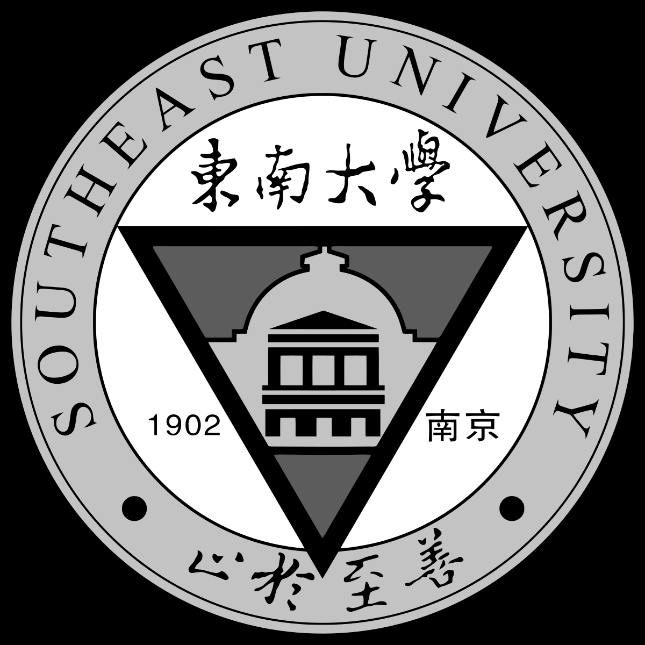

# 实验一 

## 讲解实验课安排和验收方式、以及报告格式 

## 使用python、matlab、C++语言，安装配置环境 

## 实验内容
  1. 采用不同的插值方式将一幅图像放大或缩小到不同尺寸，查看图像存储大小以及图像质量变化（注意以灰度图像的方式打开或储存）。 
  2. 对东南大学校徽进行不同类型的仿射变换（平移、旋转、放缩、倾斜），并进行逆变换，对比前后变化。 
  3. 将前面仿射变换后的校徽（至少包含平移、旋转、放缩、倾斜中的三种）和正常的校徽进行配准。 

*注：实验算法代码体现自己的工作量，实在不行可调用现有的函数，不过要有自己对相关方法的思考，也不要有抄袭（会有AI手段检查）。代码可用相关注释体现自己的思考，也可书写相关文档进行代码、方法的展示（任何觉得合适的形式均可）。*