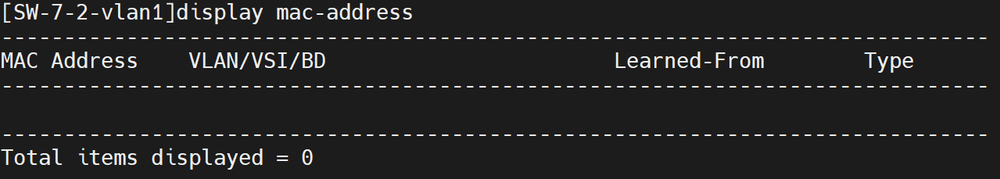
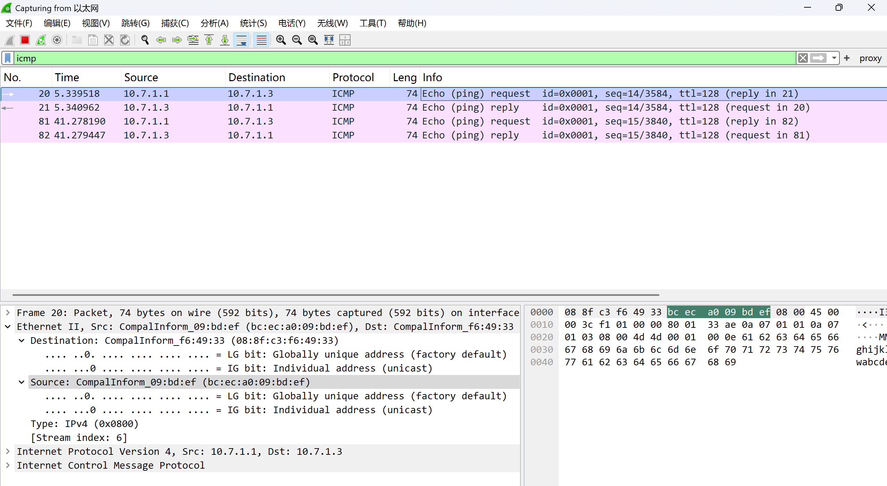
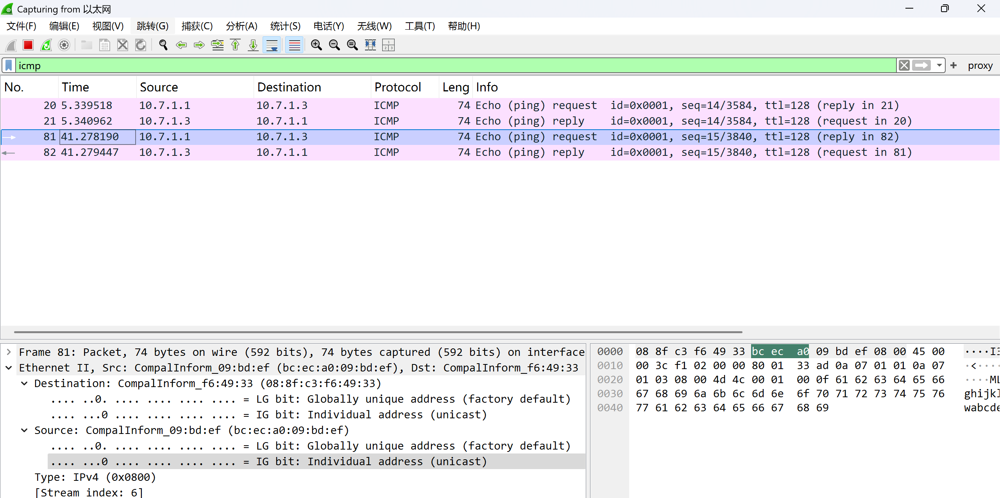
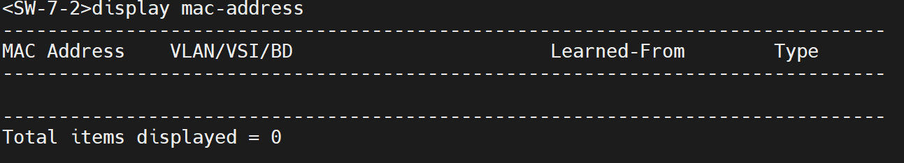
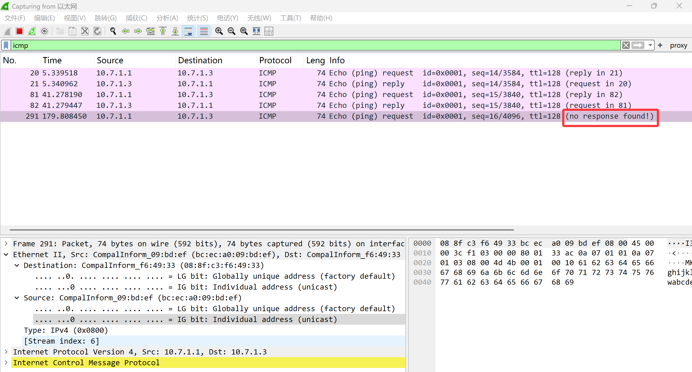
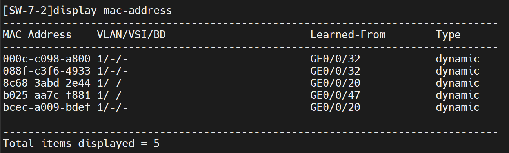
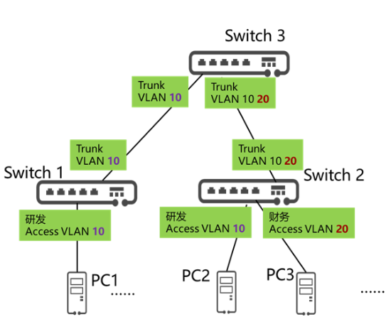
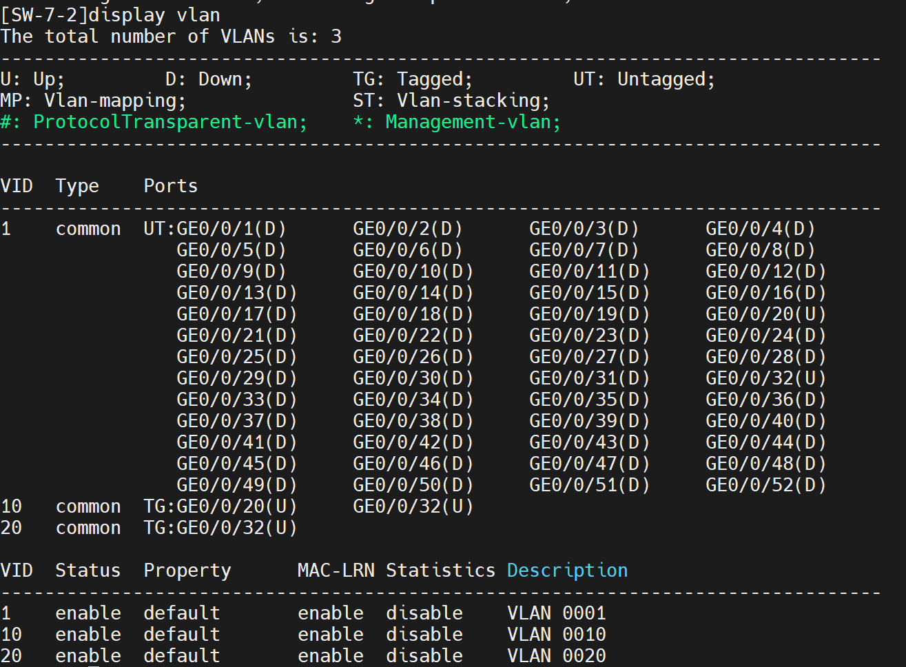
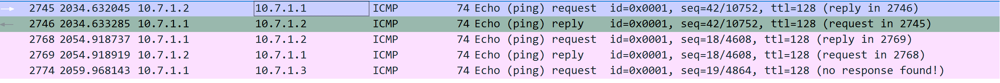
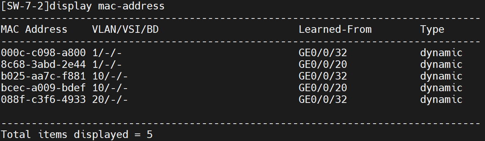

# 第一次实验

在VLAN视图下清空MAC地址

```bash
undo mac-address
vlan 1
mac-address learning disable
display mac-address
```







依然是空表



打开学习后ping，第一次没有reply，第二次没收到



同时表更新





作为Switch3设置vlan





