switch 6 通过24 连接到switch3，vlan为100

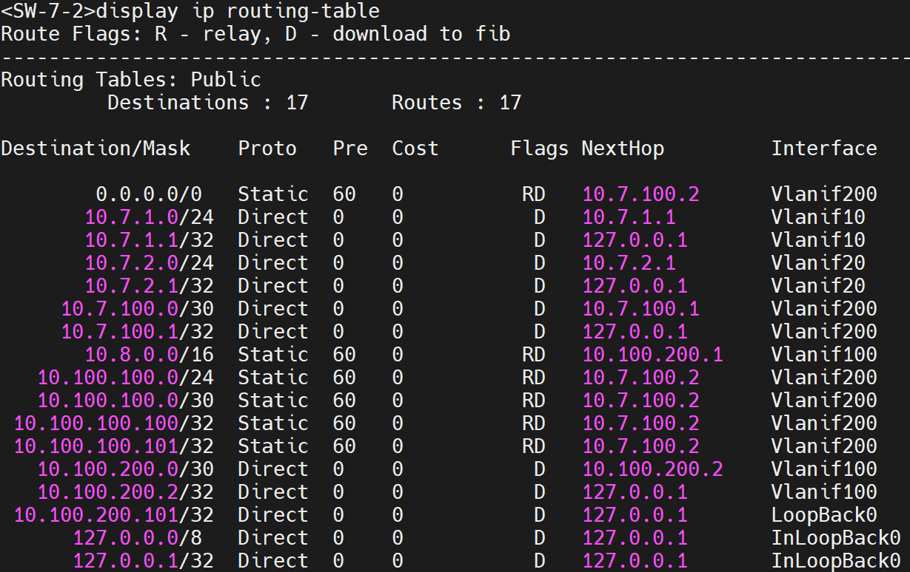

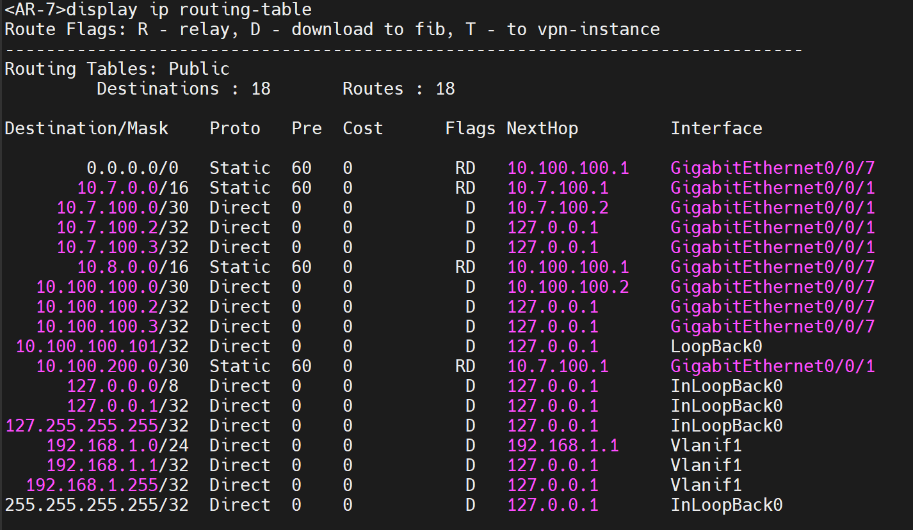

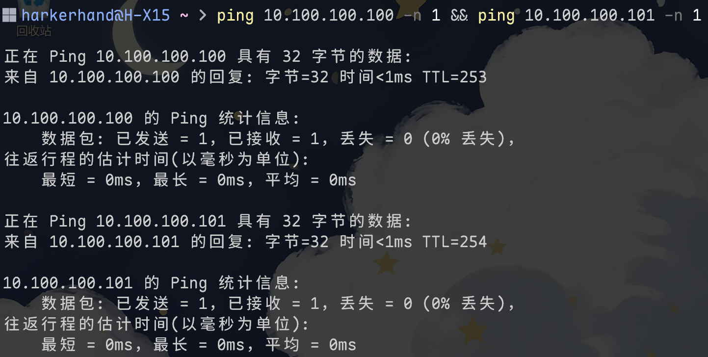

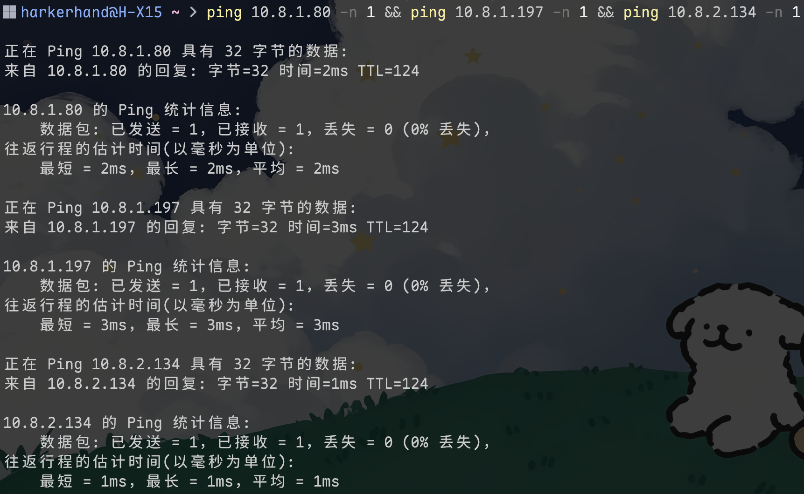

```shell
// SW
network 10.100.200.0 0.0.0.3
network 10.100.200.101 0.0.0.0
network 10.7.0.0 0.0.255.255
// AR
network 10.100.100.0 0.0.0.3
network 10.100.100.101 0.0.0.0
network 10.7.100.0 0.0.0.3
```


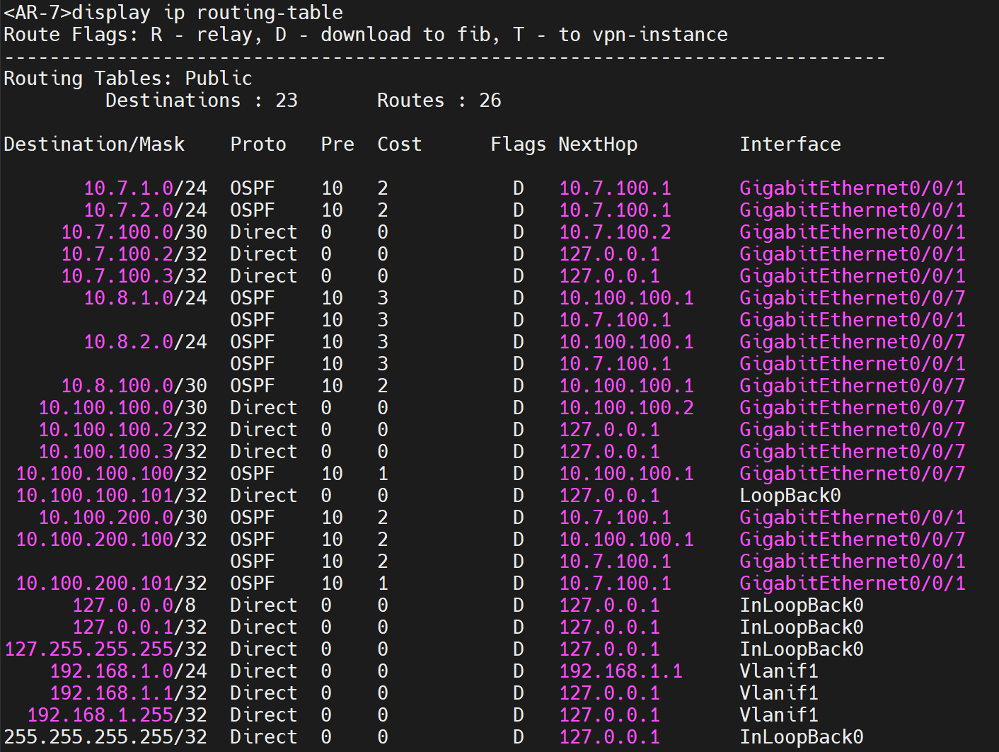

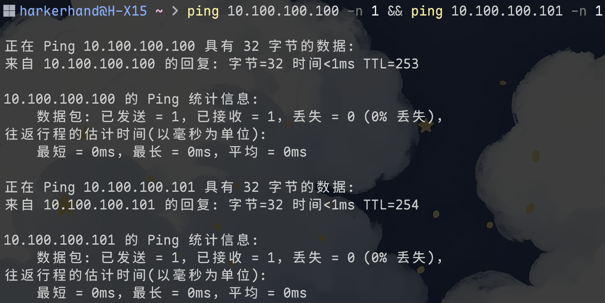

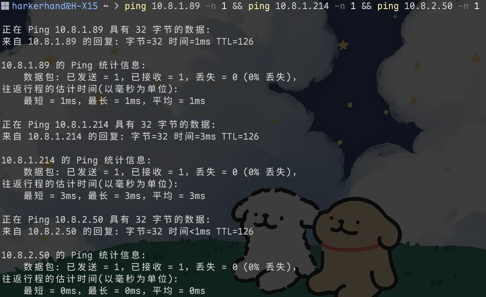

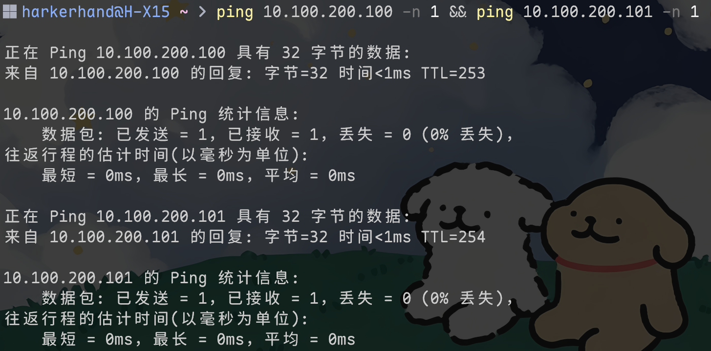

**拔路由器线**

交换机没变

路由器两条变一条

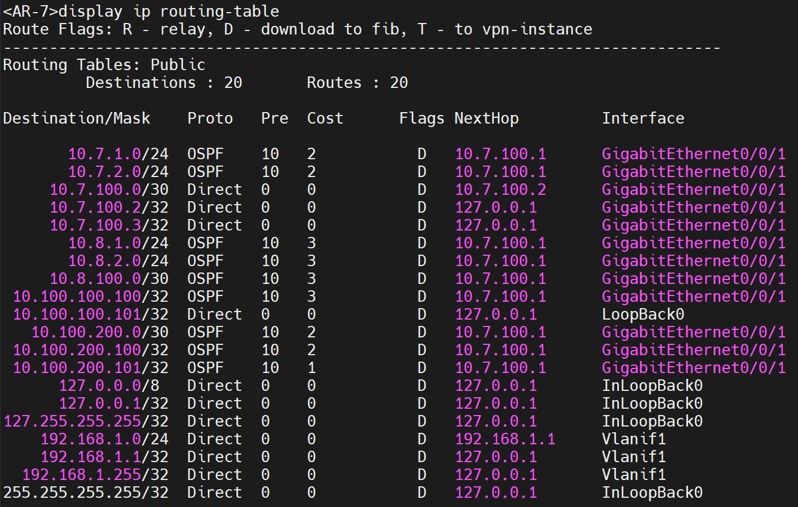

**拔交换机线**

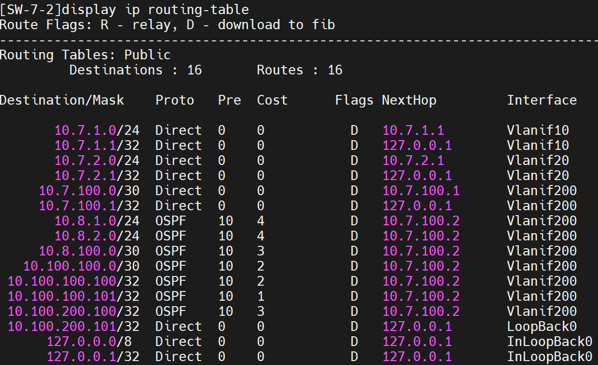

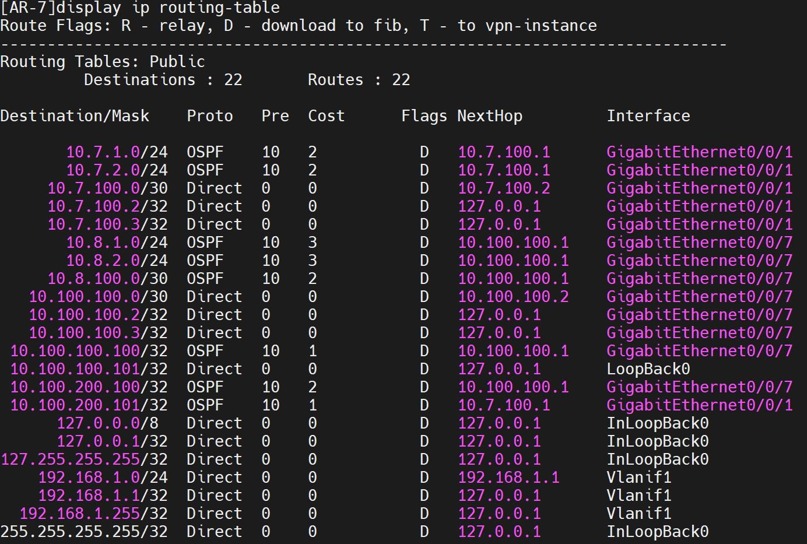

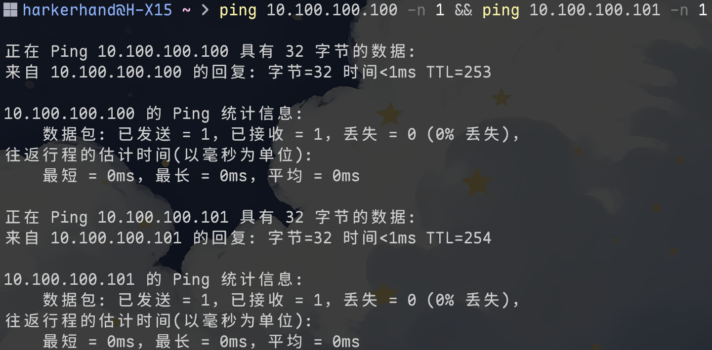

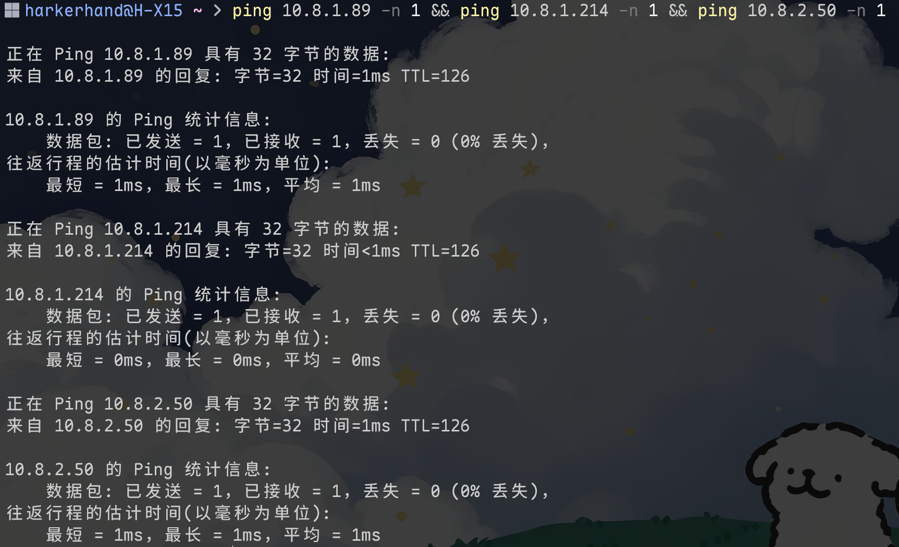